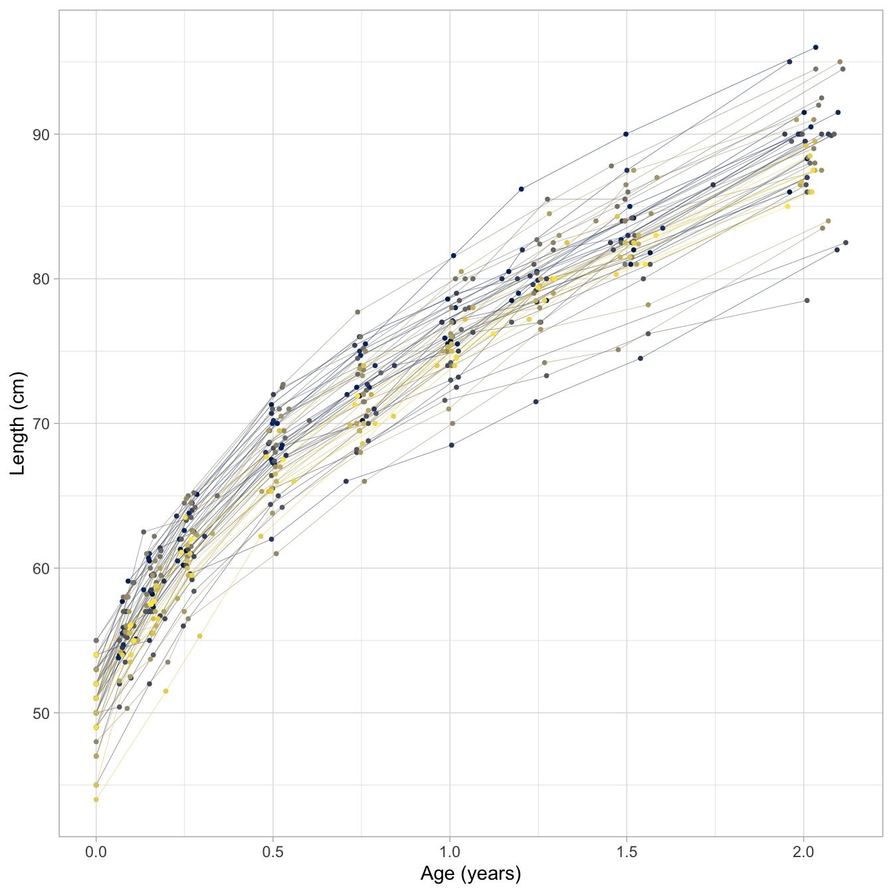
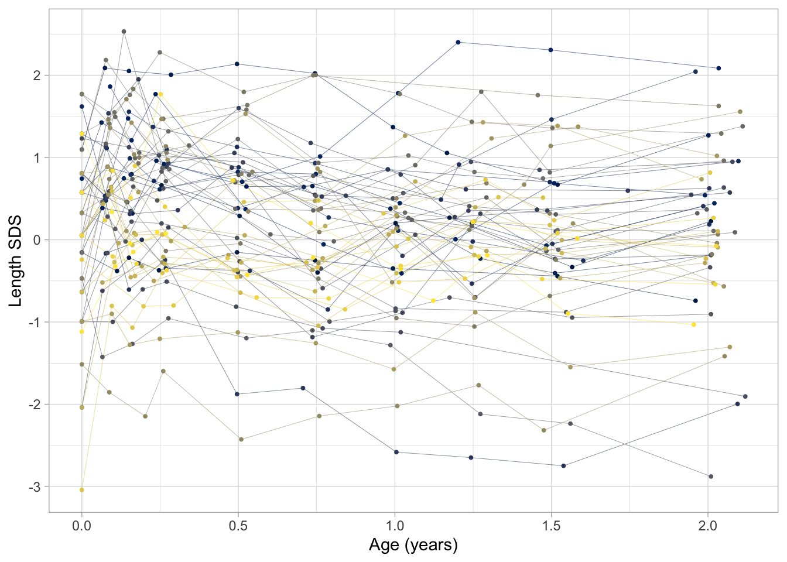
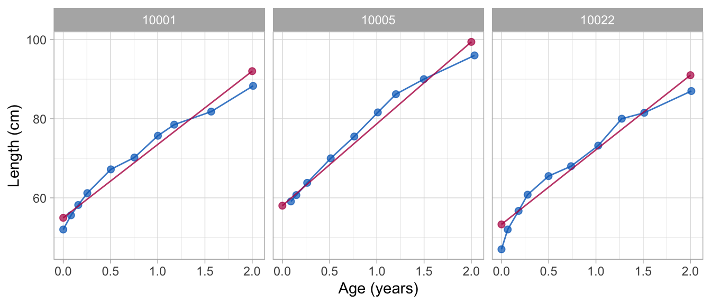
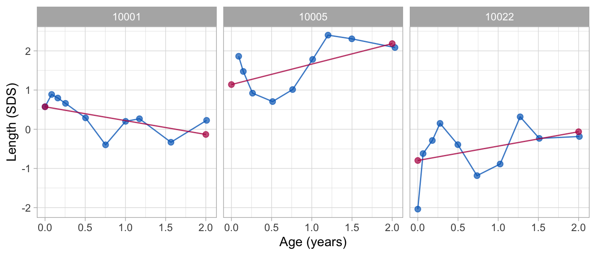
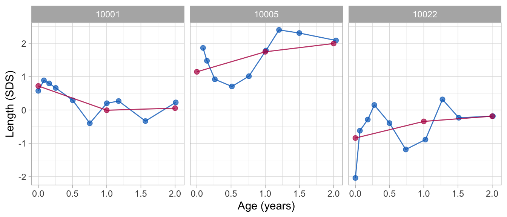
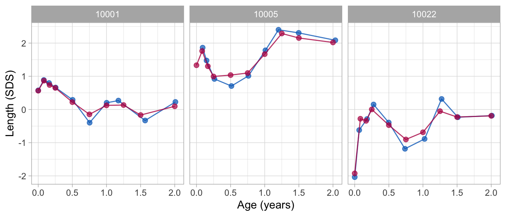

# Overview of main functions

## Objective

This vignette demonstrates three major functions in the `brokenstick`
package:
[`brokenstick()`](https://growthcharts.org/brokenstick/reference/brokenstick.md),
[`predict()`](https://rdrr.io/r/stats/predict.html) and
[`plot()`](https://rdrr.io/r/graphics/plot.default.html). We also need
`dplyr` and `ggplot2`.

``` r
require("brokenstick")
require("dplyr")
require("ggplot2")
```

For more elaborate documentation, see the
[manual](https://growthcharts.org/brokenstick/articles/manual/manual.html).

## Plot trajectories

The `smocc_200` data in the `brokenstick` package contain the heights of
200 Dutch children measured on 10 visits at ages 0-2 years.

``` r
data <- brokenstick::smocc_200
head(data, 3)
```

    ## # A tibble: 3 × 7
    ##      id    age sex       ga    bw   hgt hgt_z
    ##   <dbl>  <dbl> <chr>  <dbl> <dbl> <dbl> <dbl>
    ## 1 10001 0      female    40  3960  52   0.575
    ## 2 10001 0.0821 female    40  3960  55.6 0.888
    ## 3 10001 0.159  female    40  3960  58.2 0.797



Figure 1 dispays the data from the first 500 rows as a set of growth
curves of Dutch children. Curves are steeper during the first few
months, so child growth is faster for young infants. Note also there are
more cross-overs during the first half year, whereas fewer occur later.
This means that the relative positions have been settled by the age of 2
years, or - put differently - that the correlation between time points
at those ages is high.

``` r
ggplot(data[1:500, ], aes(x = age, y = hgt_z, group = id, color = as.factor(id))) +
  geom_line(size = 0.1) + 
  geom_point(size = 0.7) +
  scale_colour_viridis_d(option = "cividis") +
  xlab("Age (years)") +
  ylab("Length SDS") +
  theme_light() +
  theme(legend.position = "none")
```



Figure 2 dispays the same data, but with the vertical axis changed to
Standard Deviation Scores (SDS), or $`Z`$-score. The $`Z`$-score is the
height corrected for age relative to the Dutch height reference from the
Fourth Dutch Growth Study. The $`Z`$-score transformation takes away the
major time trend, so all curves are more or less flat. This allows us to
see a more detailed assessment of individual growth.

The plots also show how the measurements are clustered around ten ages:
birth, 1, 2, 3, 6, 9, 12, 15, 18 and 24 months. While the design was
followed rigorously in the study, some variation in timing is inevitable
because of weekends, holidays, sickness, and other events. The timing
variation poses a problem because we cannot directly compare the
measurement between different children (especially for figure 1). Also,
we cannot easily construct the “broad” matrix with 10 time point per
child.

Of course, we can divide the time axis into ten age groups, and treat
all point within the same age group as being measured at the same point.
This is probably a good strategy for nicely looking data - as we have
here -, but this approach is problematic in data with irregular time
intervals, of there are multiple measurement per age group, if the
measurement schedules vary by child, or in data combined from studies
that employed different designs.

The `brokenstick` package contains tools to approximate the observed
data by a series of connecting straight lines. When these lines closely
follow the data, we may replace each trajectory by its values at the
breakpoints. The statistical analysis can then be done on the
regularised trajectories, which is easier than working with the observed
data.

## Fit broken stick model with one line

We fit a trivial broken stick model with just one line on ages between
birth and two years, and plot the trajectories of three selected
children as follows:

``` r
set.seed(123)
fit <- brokenstick(hgt ~ age | id, data, knots = c(0, 2))
ids <- c(10001, 10005, 10022)
plot(fit, group = ids, 
     xlab = "Age (years)", ylab = "Length (cm)")
```



The following plot displays the same data, but in standardised units so
as to increase the analytic resolution:

``` r
fit0 <- brokenstick(hgt_z ~ age | id, data, knots = c(0, 2))
plot(fit0, group = ids,
     xlab = "Age (years)", ylab = "Length (SDS)")
```



Note that both approximations describe the individual trend in the data,
but do not address any systematic deviations from the trend.

## Fit broken stick model with two lines

The *broken stick model* describes a trajectory by a series of connected
straight lines. We first calculate a model with two connected lines. The
first line starts at birth and end at the age of exactly 1 years. The
second line spans the period between 1 to 2 years. In addition, the
lines must connect at the age of 1 year. We estimate and plot the model
as follows:

``` r
fit2 <- brokenstick(hgt_z ~ age | id, data = data, knots = c(0, 1, 2))
plot(fit2, group = ids, xlab = "Age (years)", ylab = "Length (SDS)")
```



The plot shows that the two-line model is still fairly crude. The `fit2`
object holds the parameter estimates of the model:

``` r
summary(fit2)
```

    ## Class        brokenstick (kr)
    ## Variables    hgt_z (outcome), age (predictor), id (group)
    ## Data         1942 (n), 36 (nmis), 200 (groups)
    ## Parameters   16 (total), 4 (fixed), 4 (variance), 6 (covariance), 2 (error)
    ## Knots        0 1 2 
    ## Means        -0.0396  0.0421  0.0628 
    ## Residuals    0.126 0.154 0.168 0.193 0.349 (min, P25, P50, P75, max)
    ## Mean resid   0.18 
    ## R-squared    0.868 
    ## 
    ## Variance-covariance matrix
    ##       age_0 age_1 age_2
    ## age_0 1.237            
    ## age_1 0.490 0.849      
    ## age_2 0.482 0.778 0.849

The console output lists the knots of the model, including the left and
right boundary knots at 0 and 2.6776. The row of `means` correspond to
the fixed effect estimates of the linear mixed model. We may interpret
these as the global means. Next, the output lists the
variance-covariance matrix of the random effects. The model contains 16
parameters in total: four fixed effects (means), four random effects
(diagonal elements), 6 covariance (off-diagonal elements) and 2 error
variances (one for the residual error variance, one for the variability
of the error per cluster). These parameters are enough to reconstruct
the broken stick model, and to apply it to new data.

## Extend to nine lines

We refine the model in the first two years by adding a knot for each age
at which a visit was scheduled. This model can be run as

``` r
knots <- round(c(0, 1, 2, 3, 6, 9, 12, 15, 18, 24)/12, 4)
fit9 <- brokenstick(hgt_z ~ age | id, data = data, knots = knots)
```

This optimization problem is more difficult, so it takes slightly longer
to run. The results are

``` r
summary(fit9)
```

    ## Class        brokenstick (kr)
    ## Variables    hgt_z (outcome), age (predictor), id (group)
    ## Data         1942 (n), 36 (nmis), 200 (groups)
    ## Parameters   79 (total), 11 (fixed), 11 (variance), 55 (covariance), 2 (error)
    ## Knots        0.0000 0.0833 0.1667 0.2500 0.5000 0.7500 1.0000 1.2500 1.5000 2.0000 
    ## Means        -0.17965  0.01813  0.00134  0.06579  0.05992 -0.00659  0.01225  0.04084 -0.01618  0.09582 
    ## Residuals    0.0195 0.0322 0.0412 0.0581 3.1937 (min, P25, P50, P75, max)
    ## Mean resid   0.0741 
    ## R-squared    0.981 
    ## 
    ## Variance-covariance matrix
    ##            age_0 age_0.0833 age_0.1667 age_0.25 age_0.5 age_0.75 age_1 age_1.25
    ## age_0      1.762                                                               
    ## age_0.0833 1.140      1.344                                                    
    ## age_0.1667 1.075      1.090      1.222                                         
    ## age_0.25   0.903      1.002      0.986    1.031                                
    ## age_0.5    0.621      0.816      0.800    0.802   0.914                        
    ## age_0.75   0.595      0.679      0.672    0.699   0.841    0.890               
    ## age_1      0.488      0.600      0.566    0.593   0.766    0.785 0.836         
    ## age_1.25   0.445      0.612      0.569    0.597   0.750    0.793 0.823    0.953
    ## age_1.5    0.463      0.599      0.602    0.593   0.775    0.787 0.799    0.899
    ## age_2      0.387      0.486      0.522    0.548   0.734    0.774 0.779    0.891
    ##            age_1.5 age_2
    ## age_0                   
    ## age_0.0833              
    ## age_0.1667              
    ## age_0.25                
    ## age_0.5                 
    ## age_0.75                
    ## age_1                   
    ## age_1.25                
    ## age_1.5      0.993      
    ## age_2        0.921  1.07

There nine-line model summarises the data by 79 parameters. This model
fits substantially better. The model residuals are substantially smaller
(0.075 instead of 0.179) and the proportions of explained variance is
much higher (0.983 instead of 0.867).



The figure shows that the nine-line broken stick model fits the observed
data very well.

## Obtain predicted values

The [`predict()`](https://rdrr.io/r/stats/predict.html) function allows
us to obtain various types of predictions from the broken stick model.
The simplest call

``` r
p1 <- predict(fit2)
head(p1)
```

    ##   .pred
    ## 1 0.720
    ## 2 0.660
    ## 3 0.604
    ## 4 0.535
    ## 5 0.353
    ## 6 0.172

``` r
identical(nrow(data), nrow(p1))
```

    ## [1] TRUE

produces a `tibble` with the one column called `.pred` for each row in
`data`. We can bind column `.pred` to `data` for further processing.

Sometimes, we also want the prediction at the knot values, for example,
to create graphs that contain observed and modelled trajectories. We
obtain predictions at the knots by the special `x = "knots"` argument,
e.g.

``` r
p2 <- predict(fit2, x = "knots", include_data = FALSE)
head(p2)
```

    ##   .source    id age  sex ga bw hgt hgt_z    .pred
    ## 1   added 10001   0 <NA> NA NA  NA    NA  0.71975
    ## 2   added 10001   1 <NA> NA NA  NA    NA -0.00746
    ## 3   added 10001   2 <NA> NA NA  NA    NA  0.05538
    ## 4   added 10002   0 <NA> NA NA  NA    NA -0.23366
    ## 5   added 10002   1 <NA> NA NA  NA    NA -0.37600
    ## 6   added 10002   2 <NA> NA NA  NA    NA -0.49814

``` r
nrow(p2)
```

    ## [1] 600

We use the `include_data = FALSE` argument to remove predictions for the
observed data. The output is more verbose and includes the grid of knots
for each child (`id`, `age`). The column `.source` is equal to `added`
as all rows are non-observed data.

Note there are also knots at ages 0.00 and 2.68 years. These are
boundary knots, and added by the
[`brokenstick()`](https://growthcharts.org/brokenstick/reference/brokenstick.md)
function. The boundary knots effectively filter the observations that
enter the calculations. By default, the boundary knots span the age
range in the data. For technical reasons, the broken stick model also
defines and estimates parameters for these knots, but these may in
general be ignored, especially when the data near the boundary knots are
sparse.

If we wish to obtain estimates at both the knots and the observed data
use:

``` r
p3 <- predict(fit2, x = "knots", hide = "none")
table(p3$.source)
```

    ## 
    ## added  data 
    ##   800  1942

This return 1942 rows for the data and 800 rows for the knots.

## Explained variance

The proportion of the variance of the outcome explained by the two-line
model is

``` r
get_r2(fit2)
```

    ## [1] 0.868

For the second model we get

``` r
get_r2(fit9)
```

    ## [1] 0.981

so the nine-line broken stick model explains about 98 percent of the
variance of the height SDS.

## Subject level analysis

Suppose we are interest in knowing the effect of sex, gestational age
and birth weight on the height SDS at the age of 2 years. This is an
analysis at the subject level. Let us first extract the subject-level
data with variables that vary over subjects only.

``` r
subj <- data %>%
  select(id, sex, ga, bw) %>% 
  group_by(id) %>% 
  slice(1)
head(subj, 3)
```

    ## # A tibble: 3 × 4
    ## # Groups:   id [3]
    ##      id sex       ga    bw
    ##   <dbl> <chr>  <dbl> <dbl>
    ## 1 10001 female    40  3960
    ## 2 10002 male      38  3210
    ## 3 10003 female    40  4170

We also need the outcome variable. We take it from the broken stick
estimates from the nine line solution and append it to the subject level
data.

``` r
bs <- predict(fit9, x = "knots", shape = "wide", include_data = FALSE)
data <- bind_cols(subj, select(bs, -id))
head(data, 3)
```

    ## # A tibble: 3 × 14
    ## # Groups:   id [3]
    ##      id sex       ga    bw    `0` `0.0833` `0.1667` `0.25`  `0.5` `0.75`    `1`
    ##   <dbl> <chr>  <dbl> <dbl>  <dbl>    <dbl>    <dbl>  <dbl>  <dbl>  <dbl>  <dbl>
    ## 1 10001 female    40  3960  0.566    0.868    0.737  0.651  0.221 -0.147  0.124
    ## 2 10002 male      38  3210 -0.187   -0.321   -0.255 -0.313 -0.232 -0.285 -0.336
    ## 3 10003 female    40  4170  1.17     2.11     1.97   2.03   2.04   1.80   1.32 
    ## # ℹ 3 more variables: `1.25` <dbl>, `1.5` <dbl>, `2` <dbl>

The names of the columns in `bs` correspond to the knot values.

The effect of the subject’s sex, gestational age and birth weight on the
height SDS at the age of 2 years (here denoted by the variable named
`2`) can be estimated as

``` r
fit1_lm <- lm(`2` ~ sex + ga + I(bw / 1000), data = data)
summary(fit1_lm)
```

    ## 
    ## Call:
    ## lm(formula = `2` ~ sex + ga + I(bw/1000), data = data)
    ## 
    ## Residuals:
    ##     Min      1Q  Median      3Q     Max 
    ## -2.8769 -0.4976  0.0662  0.6314  2.0932 
    ## 
    ## Coefficients:
    ##             Estimate Std. Error t value Pr(>|t|)    
    ## (Intercept)  1.01392    1.50377    0.67  0.50095    
    ## sexmale      0.00192    0.13136    0.01  0.98834    
    ## ga          -0.07257    0.04429   -1.64  0.10286    
    ## I(bw/1000)   0.56493    0.14522    3.89  0.00014 ***
    ## ---
    ## Signif. codes:  0 '***' 0.001 '**' 0.01 '*' 0.05 '.' 0.1 ' ' 1
    ## 
    ## Residual standard error: 0.899 on 196 degrees of freedom
    ## Multiple R-squared:  0.0803, Adjusted R-squared:  0.0662 
    ## F-statistic:  5.7 on 3 and 196 DF,  p-value: 0.00092

Note that the analysis shows there is a substantial effect of birth
weight. Of course, it might be that birth weight is directly related to
height at the age of 2 years. Alternatively, the relation could be
mediated by birth length. The following model adds birth length (the
variable named `0`) to the model:

``` r
fit2_lm <- lm(`2` ~ sex + ga + I(bw / 1000) + `0`, data = data)
summary(fit2_lm)
```

    ## 
    ## Call:
    ## lm(formula = `2` ~ sex + ga + I(bw/1000) + `0`, data = data)
    ## 
    ## Residuals:
    ##     Min      1Q  Median      3Q     Max 
    ## -2.9249 -0.5328  0.0525  0.6176  1.9086 
    ## 
    ## Coefficients:
    ##             Estimate Std. Error t value Pr(>|t|)   
    ## (Intercept)   3.5578     1.6887    2.11   0.0364 * 
    ## sexmale      -0.0118     0.1287   -0.09   0.9268   
    ## ga           -0.0951     0.0440   -2.16   0.0318 * 
    ## I(bw/1000)    0.1107     0.2050    0.54   0.5897   
    ## `0`           0.2847     0.0926    3.08   0.0024 **
    ## ---
    ## Signif. codes:  0 '***' 0.001 '**' 0.01 '*' 0.05 '.' 0.1 ' ' 1
    ## 
    ## Residual standard error: 0.88 on 195 degrees of freedom
    ## Multiple R-squared:  0.123,  Adjusted R-squared:  0.105 
    ## F-statistic: 6.83 on 4 and 195 DF,  p-value: 3.66e-05

The effect of birth length on length at age 2 is very strong. There is
no separate effect of birth weight anymore, so this analysis suggests
that the relation between birth weight and length at age 2 can be
explained by their mutual associations to birth length.

## Conclusion

This vignette illustrated the use of the
[`brokenstick()`](https://growthcharts.org/brokenstick/reference/brokenstick.md),
[`plot()`](https://rdrr.io/r/graphics/plot.default.html) and
[`predict()`](https://rdrr.io/r/stats/predict.html) functions. Other
vignettes highlight various other capabilities of the package.
