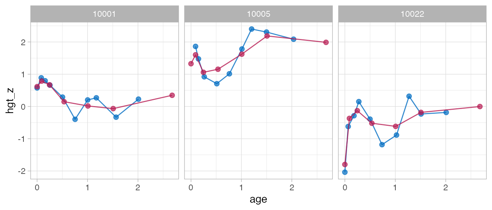

# Help for old friends

## Background

The `brokenstick` package has three major interfaces:

1.  Up to version `brokenstick 0.62.1` (before May 2020)
2.  Up to version `brokenstick 1.1.1` (May 2020 - Nov 2021)
3.  Versions higher than `brokenstick 2.0.0` (Nov 2021 - now)

This document summarises the main changes in `brokenstick 2.0.0`. See
“Help for old friends” in `brokenstick 1.1.1` for an overview of the
previous changes from `0.75.0` to `1.1.1`.

### Main changes

1.  Function
    [`brokenstick()`](https://growthcharts.org/brokenstick/reference/brokenstick.md)
    in version `2.0.0` sets the Kasim-Raudenbush sampler as the default
    method. The former method
    [`lme4::lmer()`](https://rdrr.io/pkg/lme4/man/lmer.html) remains
    available by setting `method = "lmer"` argument.

2.  Version `2.0.0` adopts the variable names of the `coda` package
    (e.g., `start`, `end`, `thin`, `niter`, and so on) and stores the
    results of the Kasim-Raudenbush sampler as objects of class `mcmc`.

3.  For `method = "kr"` one may now inspect the solution of the sampler
    by standard functions from the `coda` package. For `method = "lmer"`
    we can apply functions from the `lme4` package for `merMod` objects.

4.  Version `2.0.0` redefines the `brokenstick` class. New entries
    include `call`, `formula`, `internal`, `sample`, `light`, `data`,
    `imp` and `mod`. Removed entries are `knots` (renamed to `internal`)
    and `draws` (renamed to `imp`). We may omit the `newdata` argument
    for the training data. Setting `light = TRUE` creates a small
    version of the `brokenstick` object. Objects of class `brokenstick`
    are not backwards compatible, so one should regenerate objects of
    class `brokenstick` in order use newer features in `2.0.0`.

5.  Version `2.0.0` conforms to classic model fitting interface in `R`.
    Renames the `new_data` argument to `newdata` to conform to
    [`predict.lm()`](https://rdrr.io/r/stats/predict.lm.html). Methods
    [`plot()`](https://rdrr.io/r/graphics/plot.default.html) and
    [`predict()`](https://rdrr.io/r/stats/predict.html) no longer
    require a `newdata` argument. All special cases of
    [`predict()`](https://rdrr.io/r/stats/predict.html) updated and
    explained in documentation and examples.

6.  Version `2.0.0` adds methods
    [`coef()`](https://rdrr.io/r/stats/coef.html),
    [`fitted()`](https://rdrr.io/r/stats/fitted.values.html),
    [`model.frame()`](https://rdrr.io/r/stats/model.frame.html),
    [`model.matrix()`](https://rdrr.io/r/stats/model.matrix.html),
    [`print()`](https://rdrr.io/r/base/print.html) and
    [`summary()`](https://rdrr.io/r/base/summary.html) for the
    `brokenstick` object.

7.  Simplifies algorithmic control. Renames `control_brokenstick()` to
    [`set_control()`](https://growthcharts.org/brokenstick/reference/set_control.md)
    and removes a layer in the control list.

8.  Added support for `hide` argument in user-oriented functions.
    Automatic suppression of last knot.

### Minor changes

- Stabilises the [`rgamma()`](https://rdrr.io/r/stats/GammaDist.html)
  calls in KR-algorithm for edge cases.
- `predict_brokenstick()` can now work with the both (internal) training
  and (external) test data.
- Removes the superfluous `type` argument from
  [`predict.brokenstick()`](https://growthcharts.org/brokenstick/reference/predict.md)
- Adds a function
  [`get_omega()`](https://growthcharts.org/brokenstick/reference/get_omega.md)
  to extract the variance-covariance matrix of the broken stick
  estimates
- Improves error messages of edge cases in `test-brokenstick_edge.R`
- Perform stricter tests on arguments of
  [`brokenstick()`](https://growthcharts.org/brokenstick/reference/brokenstick.md)
- Introduces argument `warn_splines` in
  [`make_basis()`](https://growthcharts.org/brokenstick/reference/make_basis.md)
  to suppress uninteresting warns from
  [`splines::bs()`](https://rdrr.io/r/splines/bs.html)
- Removes superfluous `knotnames` argument in
  [`make_basis()`](https://growthcharts.org/brokenstick/reference/make_basis.md)
- Argument `x` in
  [`make_basis()`](https://growthcharts.org/brokenstick/reference/make_basis.md)
  is now a vector instead of a column vector
- Introduces new `xname` argument in
  [`make_basis()`](https://growthcharts.org/brokenstick/reference/make_basis.md)
  to set the xname

## Install legacy version

We recommend changing your code to reflect the above changes and run
`brokenstick 2.4.0` or higher. If needed, version `1.1.1` can be
installed as

``` r
library("devtools")
install_github("growthcharts/brokenstick@9b969af")
```

## Examples

### Example 1: Fit model

Fit model, brokenstick package version `0.75.0` - `1.1.1`:

``` r
library(brokenstick)
data <- brokenstick::smocc_200

# formula interface
fit1 <- brokenstick(hgt.z ~ age | id, data)

# XY interface - numeric vector
# Deprecated in v2.0.0
fit2 <- with(data, brokenstick(age, hgt.z, id))

# XY interface - data.frame
# Deprecated in v2.0.0
fit3 <- with(data, brokenstick(data.frame(age), hgt.z, id))

# XY interface - matrix
# Deprecated in v2.0.0
tt <- as.matrix(data[, c(1, 2, 7)])
fit4 <- brokenstick(tt[, "age", drop = FALSE],
                    tt[, "hgt.z", drop = FALSE],
                    tt[, "id", drop = FALSE])
```

Fit model, brokenstick package version `2.4.0`:

``` r
library(brokenstick)
data <- brokenstick::smocc_200

# formula interface
fit1 <- brokenstick(hgt_z ~ age | id, data)
```

### Example 2: Predict model

Predict model, brokenstick package version `0.75.0` - `1.1.1`:

``` r
# predict at observed data
p1 <- predict(fit1, data)

# predict at knots
p2 <- predict(fit1, data, x = "knots")

# predict at both observed data and knots
p3 <- predict(fit1, data, x = "knots", strip_data = FALSE)

# predict knots, broad matrix
p4 <- predict(fit1, data, x = "knots", shape = "wide")
```

Predict model, brokenstick package version `2.4.0`:

``` r
# predict at observed data
p1 <- predict(fit1)

# predict at knots
p2 <- predict(fit1, x = "knots", include_data = FALSE)

# predict at both observed data and knots
p3 <- predict(fit1, x = "knots")

# predict knots, broad matrix
p4 <- predict(fit1, x = "knots", shape = "wide")
```

### Example 3: Plot model

Plot trajectories, brokenstick package version `0.75.0` - `1.1.1`:

``` r
ids <- c(10001, 10005, 10022)
plot(fit1, data, group = ids, what = "all")
```

Plot trajectories, brokenstick package version `2.4.0`:

``` r
ids <- c(10001, 10005, 10022)
plot(fit1, group = ids, hide = "none")
```


