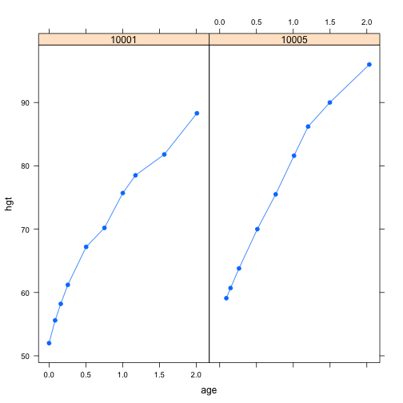
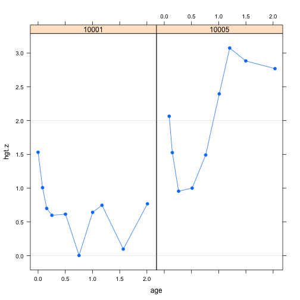
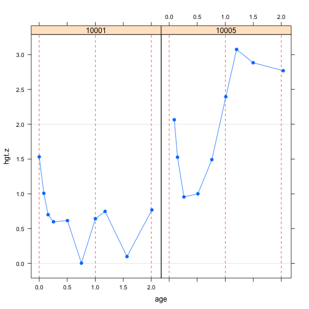

## Overview

The *broken stick model* describes a set of individual curves by a linear mixed model using first order linear B-splines. The model can be used

- to smooth growth curves by a series of connected straight lines;
- to align irregularly observed curves to a common age grid;
- to create synthetic curves at a user-specified set of break ages;
- to estimate the time-to-time correlation matrix;
- to predict future observations.

The user specifies a set of break ages at which the straight lines connect. Each individual obtains an estimate at each break age, so the set of estimates of the individual form a smoothed version of the observed trajectory. 

The main assumptions of the broken stick model are: 

- The development between the break ages follows a straight line, and is generally not of particular interest;
- Broken stick estimates follow a common multivariate normal distribution;

In order to conform to the assumption of multivariate normality, the user may fit the broken stick model on suitably transformed data that yield the standard normal ($Z$) scale. Unique feature of the broken stick model are:

- *Modular*: Issues related to nonlinearities of the growth curves in the observed scale can be treated separately, i.e., outside the broken stick model;
- *Local*: A given data point will contribute only to the estimates corresponding to the closest break ages;
- *Exportable*: The broken stick model can be exported and reused for prediction for new data in alternative computing environments.

The `brokenstick` package contains functions for

- Fitting the broken stick model to data, 
- Exporting the parameters of the model for independent use outside this package,
- Predicting broken stick curves for new data.

## Main functions

The main functions in the `brokenstick` package are:

Function name        | Description
---------------------|---------------------------------
`brokenstick()`      | Fit a broken stick model to irregular data
`conditional.means()` | Obtain the broken stick estimates from a fitted object
`predictbs()`          | Predict growth curve by the broken stick model
`export.brokenstick()` | Export the estimates of a fitted `lmer()` model object

## Exporatory analysis


```r
library(brokensticks)
data <- smocc.hgtwgt
head(data)
```

```
##     src    id rec nrec    age    sex etn ga   bw  hgt  wgt hgt.z
## 1 smocc 10001   1   10 0.0000 female  NL 40 3960 52.0 3.96 1.531
## 2 smocc 10001   2   10 0.0821 female  NL 40 3960 55.6 4.05 1.007
## 3 smocc 10001   3   10 0.1588 female  NL 40 3960 58.2 4.56 0.700
## 4 smocc 10001   4   10 0.2546 female  NL 40 3960 61.2 5.09 0.598
## 5 smocc 10001   5   10 0.5038 female  NL 40 3960 67.2 6.81 0.615
## 6 smocc 10001   6   10 0.7529 female  NL 40 3960 70.2 7.77 0.004
```

Plots of the first the height trajectories of two children can be made with the `lattice` function `xyplot()`, as follows:


```r
library(lattice)
xyplot(hgt ~ age | as.factor(id), data = data, 
	   subset = id %in% c(10001, 10005), 
	   type = "b", pch = 19, as.table = TRUE)
```

 

The plots gain more resolution when the Standard Deviation Scores (SDS) (or $Z$-values) are plotted. The column `hgt.z` contains the $Z$-scores of height relative to the WHO standard.


```r
xyplot(hgt.z ~ age | as.factor(id), data = data, 
	   subset = id %in% c(10001, 10005), 
	   type = "b", pch = 19, as.table = TRUE,
	   panel = function(...) {
	   	panel.refline(h = c(-2, 0, 2))
	   	panel.xyplot(...)
	   }
)
```

 


## Broken stick model with just two lines

The *broken stick model* attempts to describe each trajectory by a series of straight, connected lines. Let us first do a rough approximation in the above figure. We specify that we may only use two lines: One line should start at borth to the age of exactly 1 years, and another spans the period from 1 to 2 years. Moreover, we require that the lines connect at the age of 1 year. 

 

## Estimating the broken stick model 

The broken stick model is fitted to the data of all children as follows:


```r
fit2lines <- brokenstick(y = data$hgt.z, 
					     x = data$age,
						subject = data$id,
						knots = 0:2)
class(fit2lines)
```

```
## [1] "brokenstick"
```

```r
attr(fit2lines, "knots")
```

```
## [1] 0 1 2
```

*Specification*: The `knots` arguments specifies that the break ages are birth, 1 year and 2 years, respectively. The broken stick model effectively replaces the intercept by the random effects \code{x0}, \code{x1}, \code{x2} and \code{x3}. The random effects correspond to the break ages of 0, 1, 2 and 3 years, respectively. The break age of 3 years is specified for technical reason as a \code{Boundary.knot}, since the B-splines must encompass the entire age range in the data, but has no useful interpretation. No intercept is needed since every row in \code{X} adds up to one.


```r
fit2lines
```

```
## Linear mixed model fit by REML ['brokenstick']
## Formula: y ~ 0 + x1 + x2 + x3 + x4 + (0 + x1 + x2 + x3 + x4 | subject)
##    Data: data
## REML criterion at convergence: 34891.62
## Random effects:
##  Groups   Name Std.Dev. Corr          
##  subject  x1   1.1161                 
##           x2   1.0411   0.60          
##           x3   0.9616   0.58 0.96     
##           x4   0.8710   0.31 0.93 0.95
##  Residual      0.4955                 
## Number of obs: 17056, groups:  subject, 1933
## Fixed Effects:
##     x1      x2      x3      x4  
## 0.1001  0.3779  0.5219  0.9642
```

*Interpretation*: The fixed effects correspond to the mean of population of children in the data. At birth, the children are on average 0.1 SD taller than the WHO standard. At the ages of 1 and 2 years, these estimates rise to 0.38 SD and 0.52 SD, respectively. This a not surprising. The Dutch are among the tallest in the world, and we know that at the age of 2 years approximately 50% of the final height has been achieved. The estimate of 0.96 at three years is based on extreme extrapolation, and should be disregarded.

The column labeled \code{Std.Dev.} contains the standard deviations of the random effects. These numbers are expected to be around 1, since - under the assumption that the WHO standard appropriately describes this population - the dependent variable follow a standard normal distribution with zero mean and standard deviation equal to one. The \code{cor} component of the output lists the correlations between the time point. Thus, the correlation between birth length and length at 2 years is about 0.58. 

Finally, the residual (0.49) is the standard deviation of the residual of the model. 

The proportion of explained variance of outcome by the model is:


```r
var(fitted(fit2lines)) / var(data$hgt.z)
```

```
## [1] 0.7630321
```

# Plotting the broken stick estimates


# Exporting the broken stick model


```r
# export the broken stick models
export.hgt <- export.brokenstick(fit2lines)
export.hgt
```

```
## $beta
##        x1        x2        x3        x4 
## 0.1001201 0.3778678 0.5218983 0.9641944 
## 
## $omega
## <0 x 0 matrix>
## 
## $sigma2
## [1] 0.2455037
## 
## $knots
## [1] 0 1 2
## 
## $Boundary.knots
## [1] 0.0000 2.9952
## 
## attr(,"class")
## [1] "brokenstick.export"
```


# Predictions on new data


# Open issues


