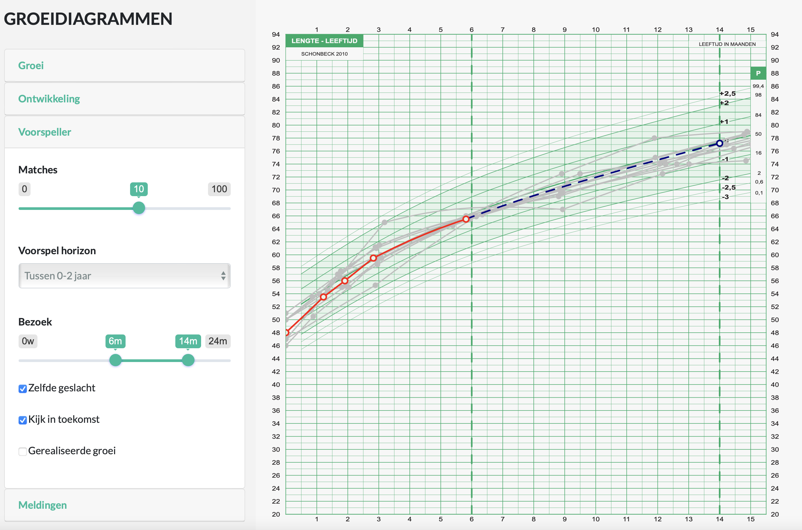

```{r setup, include=FALSE}
if (packageVersion("brokenstick") < "2.5.0") stop("brokenstick 2.5.0 needed")
require("brokenstick")
require("dplyr")
require("tidyr")
require("ggplot2")
require("lattice")

old <- options(digits = 3, width = 72)
knitr::opts_chunk$set(echo = TRUE, cache = FALSE, fig.height = 7, fig.width = 7, out.width = "100%")
colors <- c("#006CC2B3", "#B61A51B3", "gray50", "#006CC2CC", "#B61A51CC", "gray50")
```

Published as: Stef van Buuren (2023), Broken Stick Model for Irregular Longitudinal Data. *Journal of Statistical Software*, 106(7), 1--51. <doi:10.18637/jss.v106.i07>

# Abstract {-}

  Many longitudinal studies collect data that have irregular observation times, often requiring the application of linear mixed models with time-varying outcomes. This paper presents an alternative that splits the quantitative analysis into two steps. The first step converts irregularly observed data into a set of repeated measures through the broken stick model. The second step estimates the parameters of scientific interest from the repeated measurements at the subject level. The broken stick model approximates each subject's trajectory by a series of connected straight lines. The breakpoints, specified by the user, divide the time axis into consecutive intervals common to all subjects. Specification of the model requires just three variables: time, measurement and subject. The model is a special case of the linear mixed model, with time as a linear $B$-spline and subject as the grouping factor. The main assumptions are: subjects are exchangeable, trajectories between consecutive breakpoints are straight, random effects follow a multivariate normal distribution, and unobserved data are missing at random. The **R** package **brokenstick** v2.5.0 offers tools to calculate, predict, impute and visualise broken stick estimates. The package supports two optimisation methods, including options to constrain the variance-covariance matrix of the random effects. We demonstrate six applications of the model: detection of critical periods, estimation of the time-to-time correlations, profile analysis, curve interpolation, multiple imputation and personalised prediction of future outcomes by curve matching.

# Introduction

Most longitudinal studies plan data collection to occur at a fixed set of time points. In practice, the realized times can differ --- sometimes substantially --- from the scheduled times. There may be many reasons for such differences. For example, we planned a visit at the weekend or during a holiday, the subject did not show up, the measurement device was out of order, or the investigator fell ill. Varying observation times may also result from combining data from multiple studies, each collected according to its own design. Timing variation can be substantial in observational studies, especially if the survey lacks a pre-specified schedule. Longitudinal data with timing differences between subjects are said to be *irregular*.

Irregular observation times present significant challenges for quantitative analysis. For example, it is not easy to calculate the time-to-time correlation matrix if the data spread thinly over time. It might also be complex to predict the future from past data if subject times differ. Observation times may also relate to the process of interest. For example, more severely ill patients get measured more frequently; unmotivated cohort members respond more rarely, and so on. Conventional methods like MANOVA, regression or cluster analysis break down if observation times differ or if drop-out is selective.

While irregular observation times occur all over science, there is no universal or principled approach to resolve the problem. One straightforward fix is to take only those dates for which data are available (e.g., dates when stocks are traded), thus ignoring the times when markets are closed. One may also create bins of time intervals around the planned times, thereby ignoring within-period differences. Another ad-hoc method predicts the value at the scheduled time from neighboring data, e.g., by linear interpolation or smoothing, typically reducing the variability in the data. Some quick fixes create data sets where the timing problem seems to have "gone away", which may tempt the analyzingt to ignore the potential effects of data patch-up on the substantive conclusions. While convenient and straightforward, the thoughtless application of these fixes introduces significant spurious relations over time, especially if the spacing of observations is highly irregular [@rehfeld2011]. Binning can lead to "surprisingly large" biases [@towers2014]. If timing variation is related to the outcome of interest, these methods may result in biased estimates and exaggerated claims [@pullenayegum2016].

The linear mixed model for longitudinal data [@laird1982; @fitzmaurice2011] is the standard for analyzing irregular data. The model represents each subject's observed curve by a parametric function of time. The parameter estimates of this function are specific to each subject and modeled as random effects. The linear mixed model is beneficial for irregular data. It borrows strength across different realizations of the same process, summarizing each trajectory by a small number of parameters that vary over subjects. The analyst can break down the distribution of these random effects as a function of individual characteristics. The linear mixed model is attractive when the number of measurements differs between individuals or when the measurements are taken at different times.

This paper explores the use of the *broken stick model* to transform irregularly observed data into *repeated measures*. The broken stick model describes a curve by a series of connected straight lines. The model has a long history and is known under many other names, among others, *segmented straight lines* [@bellman1969], *piece-wise regression* [@toms2003], *structural change models* [@bai2003], *broken line smoothing* [@koutsoyiannis2000] and *segmented regression* [@lerman1980]. The term *broken stick* goes back to at least @macarthur1957, who used it in an analogy to indicate the abundance of species. Most of the literature on the broken stick model concentrates on the problem of finding optimal times at which the lines should connect. Instead, the present paper will focus on the problem of summarizing irregular individual trajectories by estimates made at a *pre-specified time grid*. This time grid is identical for all individuals, but it need not be equidistant. Our model formulation is a special case of the linear mixed model, with time modeled as a set of random effects coded as a linear $B$-spline and subjects as the grouping factor. The output of the transformation is a set of repeated measures, where every subject obtains a score on every time point.

Many **R** packages offer tools for interpolation. The **splines** package [@r2020] and the **akima** package [@akima2021] contains classic interpolation methods for one- and two-dimensional smoothing. Most contributed packages concentrate on time series or spatial interpolation. See @li2014 and @lepot2017 for overviews of the different concepts and methodologies. Most interpolation techniques rely on neighboring information, in time, space or both. The broken stick model addresses the problem where many independent replications provide short irregular multivariate time series, say of 5-30 time points. The scientific interest is to dynamically predict and update future observations. The model applies the linear mixed model to increase stability for such series by borrowing information across replicates. As there are no satisfactory solutions to this problem, the **brokenstick** package [@pkg:brokenstick] intends to fill this gap. Package **brokenstick** is available from the Comprehensive **R** Archive Network at <https://CRAN.R-project.org/package=brokenstick>.

Substantive researchers often favor repeated measures over the use of linear mixed models because of their simplicity. For example, we can easily fit a subject-level model to predict future outcomes conditional on earlier data with repeated measures data. While such simple regression models may be less efficient than modelling the complete data [@diggle2002, Section 6.1], increased insight may be more valuable than increased precision.

The broken stick model requires a specification of a sensible set of time points at which the measurements ideally should have been taken. For each subject, the model predicts or imputes hypothetical observations at those times, so the substantive analysis applies to the repeated measures instead of the irregular data. This strategy is akin to Diggle's multi-stage model-fitting approach [@diggle1988]. The envisioned two-step analytic process aims to provide the best of both worlds.

Some applications of the broken stick model are:

-   To approximate individual trajectories by a series of connected straight lines;
-   To align irregularly observed curves to a joint age grid;
-   To impute realizations of individual trajectories;
-   To estimate the time-to-time correlation matrix;
-   To predict future observations.

The original motivation for developing the broken stick model was to facilitate the statistical analysis and testing of critical ages in the onset of childhood obesity [@dekroon2010], with extensions to multiple imputation [@vanbuuren2018]. There is good support in **R** for fitting child growth data. We mention some related approaches. Methods for estimating growth references with parametric models are `gamlss()` from **gamlss** [@stasinopoulos2007] and its Bayesian incarnation `bamlss()` from **bamlss** [@umlauf2021]. Nonparametric alternatives that estimate quantiles directly are `rq()` from **quantreg** [@koenker2018] and `expectreg.ls()` from **expectreg** [@otto-sobotka2021]. Methods for modelling and smoothing growth curves fit trajectories per child include `smooth.basisPar()` from **fda** [@ramsay2021], `gam()` from **mgcv** [@wood2011], `loess()` and `smooth.spline()` from base **stats** [@r2020]. Models that smooth by borrowing strength across children are `face.sparse()` from **face** [@xiao2021], `lmer()` from **lme4** [@bates2015], and `sitar()` from **sitar** [@cole2021]. The broken stick model fits in the latter tradition, and features an intuitive parametrization of each individual growth curve as a series of connected straight lines. See @anderson2019 for an overview and comparison of these methods.

The present paper highlights various computational tools from the **brokenstick** v2.5.0 package. The package contains tools to fit the broken stick model to data, export the fitted model's parameters, create imputed values of the model, and predict broken stick estimates for new data. Also, the text illustrates how the tool helps to solve various analytic problems.

# Illustration of broken stick model

As a first step, let us study the variation in the age of measurement of 200 children from the SMOCC study [@herngreen1994]. @lokku2020 suggest the *abacus plot* to visualize this variation.

```{r visits, fig.height = 4, fig.cap = "Abacus plot of observation times for the first 20 children of the SMOCC data. Data collection was done through 10 waves. Each dot represents the age at which an observation was made. The variability in timing between children rises with age.", echo=FALSE, set.theme = TRUE}
data <- smocc_200
data$month <- data$age * 12
schedule <- c(0, 0.92, 1.84, 3, 6, 9, 12, 15, 18, 24)
schedule_labels <- c("b", "4w", "8w", "3m", "6m", "9m", 
                     "12m", "15m", "18m", "24m")
lattice::dotplot(
  reorder(id, rev(id)) ~ month, data = data[1:200, ],  
  pch = 19,  col = colors[4], xlab = "Age (in months)",
  cex = 0.7, 
  scales = list(x = list(tck = 0, at = schedule,
                         labels = schedule_labels)),
  panel = function(...) {
    panel.refline(v = schedule)
    panel.dotplot(...)
  }
)
```

The blue points in Figure \@ref(fig:visits) indicate the observation times. Generally, the blue points are close to the scheduled ages (indicated by vertical lines), especially in the first half-year. Observation times vary more for older children. Several children have one or more missing visits (e.g., 10002, 10008, 10024). Some children (10012, 10015) had fairly close visits. Child 10028 dropped out after month 9.

Let us fit two models, with two and nine lines, respectively, to body length's standard deviation score (SDS).

```{r plotfit2echo, echo = TRUE, eval = FALSE}
fit2 <- brokenstick(hgt_z ~ age | id, smocc_200, seed = 1, knots = 0:2)
fit9 <- brokenstick(hgt_z ~ age | id, smocc_200, seed = 1,
knots = round(c(0:3, 6, 9, 12, 15, 18, 24)/12, 4))
```

```{r plotfit2x, echo = FALSE, fig.height = 5, fig.cap = "Data and fitted curves for three children (blue = observed data, red = fitted curves). The broken stick model with two lines (top) gives a crude approximation of the data. The model with nine lines (bottom) follows the data quite closely.", set.theme = TRUE}
fit2 <- brokenstick(hgt_z ~ age | id, smocc_200, seed = 1,
                    knots = 0:2)
fit9 <- brokenstick(hgt_z ~ age | id, smocc_200, seed = 1,
                    knots = round(c(0:3, 6, 9, 12, 15, 18, 24)/12, 4))
ids <- c(10001, 10005, 10022)
m2 <- plot(fit2, smocc_200, group = ids,
           xlab = "Age (years)", ylab = "Length (SDS)")
m9 <- plot(fit9, smocc_200, group = ids,
           xlab = "Age (years)", ylab = "Length (SDS)")
gridExtra::grid.arrange(m2, m9, nrow = 2)
```

Knot values are rounded to simplify the presentation. Figure \@ref(fig:plotfit2x) shows the individual trajectories of three children. The blue points coincide with the observed data, whereas the red curves are calculated according to the broken stick model.

There are two fitted models. The simpler model (top) uses just two line segments. The first line starts at birth and ends at the age of exactly 1 year. The second line spans the period between 1 to 2 years. Note that the two lines connect at the breakpoint, the age of 1 year. The red curves for the two-line model are a crude approximation to the data.

We can create a better model by setting breakpoints equal to the scheduled ages. Since there are 10 scheduled ages, we construct nine straight lines. In contrast to the two-line model, the nine-line broken stick model is sensitive to small bumps in the observed trajectory and closely fits the empirical data. The residual variance of the nine-line model is low (0.059), and the proportion of explained variance in SDS is high (0.98).

While the observation times in the data differ between children, the broken stick curves use identical time points across subjects. The idea is now that we can add the broken stick estimates to the child-level data by a long-to-wide conversion and analyze supplemented columns as repeated measures. A repeated measures analysis is usually simpler than the equivalent for the temporally misaligned data. For example, it is easy to calculate mean profiles for arbitrary groups, estimate the time-to-time covariance matrix, or build predictive models at the child level. See @hand1987 for a lucid overview of linear techniques for repeated measures.

# Methodology

## Notation

We adopt the notation of @fitzmaurice2011. Let $Y_{ij}$ denote the response variable for the $i^{\rm th}$ subject on the $j^{\rm th}$ measurement occasion at time $t_{ij}$. Data are collected in a sample of $N$ persons $i=1,\dots,N$. Let repeated measurements for the $i^{\rm th}$ subject be grouped as

$$ 
Y_i = \left( \begin{array} {l} Y_{i1} \\ Y_{i2} \\ \vdots \\ Y_{in_i} \end{array} \right), \quad i = 1, \dots, N.
$$

If the measures have been observed at a common same set of occasions, then we could drop the index $i$ in $t_{ij}$ since $t_{ij} = t_j$ for all $i = 1, \dots, N$. Here we will focus on the case that $t_{ij}$ varies over $i$.

In addition, let use define the $n_i \times p$ matrices

$$ 
X_i = \left( \begin{array} {llll} 
X_{i11} & X_{i12} & \cdots & X_{i1p} \\
X_{i21} & X_{i22} & \cdots & X_{i2p} \\
\vdots  & \vdots  & \ddots & \vdots  \\
X_{in_i1} & X_{in_i2} & \cdots & X_{in_ip}
\end{array} \right), \quad i = 1, \dots, N,
$$

so that the rows of $X_i$ contain $p$ covariates associated with the responses at $n_i$ measurement occasions. The columns may be time-varying covariates. If a certain covariate is fixed in time (e.g., sex, treatment, education), then all values within the corresponding column in $X_i$ are identical.

## Broken stick model

The broken stick model avoids modeling observation times $t_{ij}$ directly by representing each $t_{ij}$ as its relative position within a time interval. For example, suppose $t_{ij} = 0.6$ years and that the time interval is given by 0.5-1.0 years. The position relative to the left break age is $x_{\rm left} = (1.0-0.6)/(1.0-0.5) = 0.8$, whereas relative to the right break age is $x_{\rm right} = (0.6-0.5)/(1.0-0.5) = 0.2$. In order to fit the broken stick model, we need to replace time point $t_{ij} = 0.6$ by two values: 0.8 (for break age 0.5), and 0.2 (for break age 1.0). Note that both values add up to 1. Coding time in this way simplifies modeling continuous time by a set of discrete break ages.

More specifically, let $t_{ij}$ be coded by a second-order (linear) $B$-spline using $k$ internal knots $\kappa$ placed at $k+1$ ordered ages

$$
\kappa_0 = \kappa_1 < \dots < \kappa_k < \kappa_{k+1}
$$

The internal knots $\kappa_1, \dots, \kappa_k$ correspond to the set of ages for which we obtain broken stick estimates, and it could be specified by the user. The left boundary knot $\kappa_0 = \kappa_1$ is left-anchored to the minimum time $\min(t_{ij})$ in the data. This point defines the starting event of the participant, such as birth or study enrollment. The right hand boundary knot is $\kappa_{k+1} \geq \max(t_{ij})$.

The second-order $B$-spline [@deboor1978 pp. 32],

$$
H_s(t) = \left\{ \begin{array} {l@{\quad,\quad}l}
(t-\kappa_{s-1})/(\kappa_s - \kappa_{s-1}) & \kappa_{s-1} < t \leq \kappa_s,\\
(\kappa_{s+1}-t)/(\kappa_{s+1} - \kappa_s) & \kappa_s \leq t < \kappa_{s+1},\\
0 & {\rm otherwise.}
\end{array} \right. 
$$

is applied to $t_{ij}$ to obtain $(k+1)$ transformed variables $x_{is} = t_{ij}$ with $s = 1,\dots,k+1$. These variables can conveniently be grouped into the $n_i \times (k+1)$ matrix of covariates $X_i = (x_{i1}, \dots, x_{ik}, x_{i(k+1)})$. Each row in $X_i$ has only one or two non-zero elements, which sum to 1.

Using this $X_i$, the broken stick model is a special case (with $Z_i = X_i$) of the two-stage random-effects model [@laird1982]

$$
Y_i = X_i\beta + X_ib_i + \epsilon_i
$$

where the $k+1$ column vector $\beta$ contains $k+1$ fixed effect coefficients common to all persons, where the $k+1$ column vector $b_i$ accommodates for $k+1$ subject-specific random parameters, and where the $n_i$ column vector $\epsilon_i$ holds subject-specific residuals.

In order to complete the model specification, we assume that the residuals are identically and independently distributed as $\epsilon_i \sim N(0,\sigma^2 I(n_i))$, where $\sigma^2$ is a common variance parameter, and where $I(n_i)$ is the identity matrix of order $n_i$. Thus, the equation represents population parameters (fixed effects), individual effects (random effects), and an amount of within-person dispersion that is the same for all persons. Section \@ref(estimation-steps-explained) also considers a heterogeneous model that allows $\sigma_i^2$ to vary over subjects.

In summary, given the knot specification and the choice of the response scale, the parameters of the broken stick model are:

-   $\beta$, a vector of $k + 1$ fixed parameters;
-   $\Omega$, a $(k+1) \times (k+1)$ covariance matrix of the random effects;
-   $\sigma^2$, the within-person error variance.

The total number of parameters for a solution with $k$ internal knots is thus equal to $(k^2 + 5k + 6)/2$. For example, a model of $k = 3$ knots (i.e., with two connected lines) has 15 parameters, a model with $k = 4$ has 21 parameters, and a model with $k = 10$ break ages has 78 parameters. The heterogeneous model has one additional parameter that measures the variation of $\sigma_i^2$.

## Model assumptions

At the person level, we assume $b_i \sim N(0, \Omega)$, i.e., the random coefficients of the subjects have a multivariate normal distribution with zero mean and a $(k+1) \times (k+1)$ covariance matrix $\Omega$. The base model allows the elements of $\Omega$ to vary freely. For time-dependent data, constrained versions for $\Omega$ are also of interest [@fitzmaurice2011, Ch. 7]. Section \@ref(estimation-steps-explained) highlights two such extensions. We also assume that the covariance between $b_i$ and $\epsilon_i$ is zero. For simplicity, this paper is restricted to the case where $X_i$ includes only time, and no other covariates.

The broken stick model builds upon three main modeling assumptions:

-   The trajectory between break ages follows a straight line. This assumption may fail for processes that are convex or concave in time. For example, human height growth in centimeters is concave in time, so setting breakpoints far apart introduces a systematic negative bias. Modeling height SDS instead of raw height will prevent this bias.
-   The broken stick estimates follow a joint multivariate normal distribution. As this assumption may fail for skewed measurements, it could be beneficial to transform the outcomes so that their distribution will be closer to normal.
-   The data are *missing at random* (MAR) given the outcomes from all subjects at all observation times. This assumption is restrictive in the sense that missingness may only depend on the observed outcomes, and not on covariates other than time. At the same time, the assumption is liberal in the sense that the missingness may depend on future outcomes. While this MAR-future assumption is unusual in the literature on drop-out and observation time models, it is a sensible strategy for creating imputations that preserve relations over time, especially for intermittent missing data. Of course, the subsequent substantive analysis on the imputed data needs to be aware of the causal direction of time.

## Interpretation

Given the model estimates and the person data, we can calculate the random effect $b_i$. The *broken stick parameter* $\gamma_{is} = \beta_s + b_{is}$ is the subject-specific mean of $Y_i$ at time $\kappa_s$, $s = 1,\dots, k + 1$. The set of $\gamma_{is}$ parameters describes the mean response profile for subject $i$ by $k$ lines that connect at the $k + 1$ coordinates $(\kappa_s, \gamma_{is})$.

The broken stick parameter is the most likely value of outcome $Y_i$ for subject $i$ at time $\kappa_s$ given the person's observed data and given the fitted model (which represents the evolution of trajectories from the training data). The parameter is the center of the posterior predictive distribution for normal $Y_i$. The two-sided $100(1-\alpha)\%$ prediction interval for the true, though often unobserved, value $Y_{i,\kappa_s}$ is equal to

$$
[Y_{i,\kappa_s}^{\rm lo}, Y_{i,\kappa_s}^{\rm hi}] = \gamma_{is} \pm t_{(1-\alpha/2;N-1)}\sigma,
$$ 
where $t_{(1-\alpha/2;N-1)}$ is the $100(1-\alpha/2)$ percentile of Student's $t$-distribution with $N - 1$ degrees of freedom. For example, the 50% prediction interval $\gamma_{is} \pm 0.68\sigma$ will contain 50% of true values. For normal $Y_i$, the length of the 50% prediction interval is equivalent to the interquartile range (IQR). If the residual variation $\sigma^2$ is small (say $\sigma^2 < 0.1$), the IQR is about 0.22, so half of the true values will be within 0.22 SD of $\gamma_{is}$, a small difference. For large $\sigma^2$ (e.g., $\sigma^2 > 0.2$), the $\gamma_{i}$ vector is a smoothed representation of $Y_{i}$. While smoothness amplifies low-frequency features of the trajectories, it could also introduce biases in the subsequent analysis by suppressing high-frequency variation. In that case, the analyst needs to check whether this reduction in variation does not affect the parameters of substantive interest. We may restore high-frequency variation by adding random draws from the residual distribution $N(0, \sigma^2)$. From there, it is a small step to multiple imputation, a well-developed methodology for drawing valid inferences from incomplete data [@rubin1987; @vanbuuren2018].

If $n_i \gg k$ then the broken stick model provides a parsimonious representation of the measurements. Reversely, if $n_i \ll k$ then the model infers plausible values for subject $i$ by building strength across persons. The broken stick model converts $n_i$ irregularly observed measurements into a new set of $k$ values $\gamma_{is}$ at common ages $\kappa_1, ..., \kappa_k$, $s = 1,\dots, k$.

Since each row in $X_i$ sums to unity, the broken stick model does not have a global intercept. The linear $B$-spline coding effectively replaces the global random intercept term by $k + 1$ *local intercepts*, one at each break age. The local intercept summarizes the information available in the adjacent left and right age intervals and ignores any information beyond the two adjacent knots. The broken stick estimates are thus primarily local. Outcome data observed outside the two adjacent age intervals influence the broken stick estimates only through the subject-level part of the model, in particular through $\Omega$.

# Estimation

## Main function

The `brokenstick()` function estimates the parameters of the broken stick model. The user needs to specify the outcome, the predictor and the grouping variable, as well as the location of the knots on the predictor variable. A call produces an object of class `"brokenstick"`:

```{r}
fit <- brokenstick(hgt_z ~ age | id, data = smocc_200, knots = c(
  0, 0.5, 1, 2), seed = 12321)
summary(fit)
```

The object contains the model setting, the data and the results. The column names of $X$ consist of the name of the time variable with the knot values appended. Thus, `age_0` is birth length and `age_1` is the length at the age of 1y. Here we find estimates of the fixed effects $\beta$ under `means`, the residual variance $\sigma^2$ under `mean resid` and the variance-covariance matrix of the random effects $\Omega$ as `get_omega(fit)`. We calculate the broken stick estimates at the knot locations as a wide matrix through the `predict()` function as follows:

```{r}
bse <- predict(fit, x = "knots", shape = "wide")
dim(bse)
head(bse, 3)
```

The specification `x = "knots"` uses the special keyword `"knots"` to set the predictor values equal to the knot locations used to fit the model. The argument `shape = "wide"` returns the predicted values as a wide matrix (one row per group, one column per predictor value). As a result we now have each individual trajectory summarized by six estimates.

## Estimation steps explained

We may break up the estimation process into two main steps. The first step calculates the matrix of $B$-splines for the time variable `age` by the core `splines::bs()` [@r2020] function:

```{r}
library("splines")
data <- brokenstick::smocc_200
internal <- c(0, 0.5, 1, 2)
X <- bs(data$age, knots = internal, Boundary.knots = c(0, 2.68), 
        degree = 1)
colnames(X) <- paste("age", c(internal, 2.68), sep = "_")
head(X)
```

The numerical example shows that the `bs()` function transforms the `age` variable into five columns, the $B$-spline basis, with names like `age_0` and `age_0.5`. If `age` coincides with one of these (e.g., as in the top row), then the corresponding column receives a `1`. In all other cases, age distributes over two adjacent columns. Setting `degree = 1` specifies a $B$-spline and gives the broken stick model its name and its characteristic shape.

Although not strictly needed, all applications in this paper assume that the left boundary knot marks the start of time, e.g., birth or day of enrollment. There are some subtleties in using `splines::bs()` to create a linear $B$-spline basis. Matrix `X` has values in the range $[0, 1]$ and a maximum of two non-zero values per row that sum to $1$. These conditions require that `Boundary.knots` span at least the range of the data. This requirement is easy to achieve by setting `Boundary.knots = range(data$age)`, which is done by default. Also, we need to ensure that the range of `knots` is not outside `Boundary.knots`. We may achieve that by setting `Boundary.knots` to include at least `range(knots)`. In practice, the user does not need to worry about boundaries since the `brokenstick()` function takes care of both conditions by expanding the boundary range when needed. The primary reason for setting explicit boundaries is to make them independent of the data.

```{r include = FALSE, eval = FALSE, echo = FALSE}
# inverse age coding
X <- bs(-data$age, knots = c(-2.68, -2, -1), Boundary.knots = c(-2.68, 0), degree = 1)
colSums(X)
rowSums(X)

# inverse age model
data <- smocc_200
data$age <- -data$age
fitn <- brokenstick(hgt_z ~ age | id, data = data, knots = c(-2, -1, 0))
plot(fitn)
```

The second step is to specify the model and estimate its parameters. We have two methods for this: `"kr"` and `"lmer"`. Method `"lmer"` relies on the popular function `lme4::lmer()` [@bates2015] to fit a linear mixed normal model.

```{r mod-lmer, cache=FALSE}
data <- cbind(brokenstick::smocc_200[, c("id", "age", "hgt_z")], X)
ctl_lmer <- lme4::lmerControl(
  check.conv.grad = lme4::.makeCC("warning", tol = 0.04))
f <- hgt_z ~ 0 + age_0 + age_0.5 + age_1 + age_2 + age_2.68 +
  (0 + age_0 + age_0.5 + age_1 + age_2 + age_2.68 | id)
mod_lmer <- lme4::lmer(f, data, control = ctl_lmer)
class(mod_lmer)
```

The formula removes the intercept and specifies each knot as a random effect with child `id` as grouping factor. The `control` argument suppresses the warning `Model failed to converge with max|grad| = 0.0360913`. Such warnings occur often if the model has many random effects. These warnings may also be thrown if some of the child data are outliers (for example pre-terms). I found that the broken estimates generally look sound and reasonable despite the warnings. Note however that my experience derives primarily from child growth data, so there is no guarantee that this apparent robustness will hold for other types of data. Warnings from `lmer()` become more frequent with a higher number of knots, for smaller samples and for data with observations made at more irregular time points.

Object `mod_lmer` has class `"lmerMod"` so we may use standard `plot()`, `predict()` and `summary` methods offered by the **lme4** package. Converting the result into broken stick estimates requires summing the fixed and random effects.

```{r}
bse_lmer <- t(t(lme4::ranef(mod_lmer)$id) + lme4::fixef(mod_lmer))
head(round(bse_lmer, 3), 3)
```

The calculation time of `lme4::lmer()` rapidly increases with the number of random effects. More than ten random effects (knots) takes significant time, and beyond 15 knots is generally impossible to fit. For example, using a dataset with 33,000 records and 2,600 individuals, an M1 Max processor takes 8 seconds (5 knots), 107 seconds (9 knots), 403 seconds (12 knots) and 1172 seconds (15 knots). 

The **brokenstick** package provides another alternative, the *Kasim-Raudenbush (KR) sampler* [@kasim1998]. The method simulates draws from the posterior distributions of parameters from a two-level normal model with heterogeneous within-subject variances. The speed of the Kasim-Raudenbush sampler is almost insensitive to the number of random effects and depends primarily on the total number of iterations and somewhat on sample size. Execution of the KR method for the same problem takes 15 seconds (5 knots), 17 seconds (9 knots), 19 seconds (12 knots) and 20 seconds (15 knots). The method is available as the function `kr()` in the **brokenstick** package and is the default since version 2.0.0. The `control_kr()` function tweaks estimation options: 

```{r mod-kr, cache=FALSE}
ctl_kr <- control_kr()
mod_kr <- kr(y = data$hgt_z, x = X, g = data$id, control = ctl_kr)
```

The call to `control_kr()` produces a list with settings for the sampler according to the conventions of the **coda** package [@plummer2006]. The defaults in `control_kr()` should be reasonable across a wide range of cases. The list component `mod_kr$mod` contains various objects of class `"mcmc"` with the sampling history and detailed results. For example, inspect the fixed effect estimates as

```{r}
library("coda")
summary(mod_kr$mod$beta)
```

Also, we may obtain trace plots and densities. For example try `plot(mod_kr$mod$beta)`.

We obtain results for method `"lmer"` as

```{r}
fit_lmer <- brokenstick(hgt_z ~ age | id, data = smocc_200, knots = c(
  0, 0.5, 1, 2), method = "lmer", control = ctl_lmer)
head(predict(fit_lmer, x = "knots", shape = "wide"), 3)
```

The argument `shape = "wide"` specifies the form of the return value. The broken stick estimates from the `kr` and `lmer` methods are similar, but not identical. In fact, substantial discrepancies may occur in areas where data are sparse, for example, at the right boundary knot. Apart from being faster for more complex models, the KR-sampler opens up interesting analytic options:

1.  It is relatively easy to constrain the fitted covariance of random effects, $\Omega$, to a matrix of simple structure. Informing the sampler of the time-dependent structure of the random effect leads to stabler estimates of $\Omega$. The package currently implements two *correlations models*. These models express the correlation $\rho(t_1, t_2)$ between two Z -scores $Z_1$ and $Z_2$ at successive ages $t_1$ and $t_2$ as a function of those ages. The *Argyle model* [@argyle2008] is $\rho(t_1, t_2) = \exp(-\lambda|T_1-T_2|)$, where $T_i = \log(\tau+t_i)$ is a logarithmic rescaling of the time axis and $\rho=exp(-\lambda)$. The Cole correlation model [@cole1995] describes the Fisher-transformed correlation as a function of the average $(t_1+t_2)/2$ and the difference $(t_2-t_1)$, including two multiplicative terms. Note that both models were proposed in the context of child growth, so may fit less well for other types of time-dependent data.

2.  The Kasim-Raudenbush sampler fits the slightly more general linear-mixed model with heterogeneous within-subject variances, i.e., with a residual variance $\sigma_i^2$ per subject $i$ instead of the global residual $\sigma^2$. This makes it easier to identify, study and weight subjects based on how well they fit the model.

3.  A third option is to simulate imputations as an extra step to the sampler. For subjects with large $\sigma_i^2$, the random effect estimates are a too smooth representation of the data, leading to inappropriate variance estimates when those estimates are analyzed as "just data". Section 11.3 of @vanbuuren2018 pioneered a solution that constructs multiple trajectories by adding a proper amount of residual noise to random effect estimates. The variance estimation then proceeds according to the principles of multiple imputation [@rubin1987].

# Functionality

## Overview

The **brokenstick** package contains functions to fit, predict and plot data. Main functions, user-oriented helpers, and internal functions for computation used in the **brokenstick** package are summarized in Table 1.

: Table 1: Main functions, user-oriented helpers, and internal functions for computation used in the `brokenstick` package.

| Function name   | Description                                |
|-----------------|--------------------------------------------|
|                 |                                            |
| *Main functions*  |                                          |
| `brokenstick()` | Fit a broken stick model to irregular data |
| `predict()`     | Predict broken stick estimates             |
| `plot()`        | Plot individual trajectories               |
|                 |                                            |
| *Helper functions* |                                         |
| `coef()`         | Extract coefficients                    |
| `fitted()`       | Calculate fitted values                 |
| `get_knots()`    | Obtain the knots used by model          |
| `get_omega()`    | Extract the variance-covariance matrix  |
| `get_r2()`       | Obtain proportion of explained variance |
| `model.frame()`  | Extract training data                   |
| `model.matrix()` | Extract design matrix                   |
| `print()`        | Print object                            |
| `residuals()`    | Extract residuals from model            |
| `summary()`      | Summarise object                        |
|                  |                                         |
| *Computation functions* |                                  |
| `set_control()` | Generic control function                                |
| `control_kr()`  | Set controls for Kasim-Raudenbush sampler               |
| `kr()`          | Kasim-Raudenbush sampler for two-level model            |
| `EB()`          | Empirical Bayes predictor for random effects (internal) |
| `make_basis()`  | Create linear splines basis (internal)                  |

The package exports **S3** methods for the class `"brokenstick"` for the following generic functions `coef()`, `fitted()`, `model.frame()`, `model.matrix()`, `plot()`, `predict()`, `print()`, `residuals()` and `summary()`. An object of class `"brokenstick"` stores the training data by default. When this is not desired, specify `brokenstick(..., light = TRUE)` to create a small object with just the parameter estimates. Of course, we cannot extract the original data from a light object. However, we can still use it to calculate brokenstick estimates for new cases using `predict(object, newdata = ...)`.

## Data preparation

Before we can fit the model, the data need to be in shape. The `brokenstick()` function takes tidy data in the long-form. Every row in the data corresponds to one visit. Two columns identify a visit: a subject variable and a time variable. Thus, if subject one has three visits and subject two has five visits, the combined data will have eight records. This section uses the built-in `smocc_200` data, containing the heights of 200 children measured at ten visits up to two years [@herngreen1994].

```{r dataprep}
library("brokenstick")
head(smocc_200, 3)
```

The subject variable is `id` and the time variable is `age`.

## Transformation to Standard Deviation Scores (SDS)

The broken stick model can fit observations in either the raw scale $Y$ (cm, kg, and so on) or as a $Z$-score. Under a normal distribution with mean $\mu$ and standard deviation $\sigma$ the $Z$-score for a data value $Y$ is defined as $Z = (Y - \mu)/\sigma$. In statistics, it is customary to estimate $\mu$ and $\sigma$ from the data, but we can also take those values from an external *reference table*. For example, heights of boys with an age $t$ follow an approximate normal distribution with an age-specific mean $\mu_t$ and an age-specific standard deviation $\sigma_t$. A reference table consists of estimates of $\mu_t$ and $\sigma_t$ at different ages $t$. We calculate the *standard deviation score* (SDS) for a boy with height $Y$ at age $t$ as $Z = (Y - \mu_t)/\sigma_t$, with $\mu_t$ and $\sigma_t$ taken from the reference table. We can compare this $Z$-score directly to the reference population, or compare two measurements taken at different ages with the age effect removed. SDS calculation is standard methodology in child growth, and is available under many distributions. See @stasinopoulos2007 for details.

Analysis of $Z$-scores is preferable to the raw scale for several reasons:

1.  A growth curve that follows a centile in the reference distribution translates into a horizontal line in the $Z$-score scale, which simplifies modeling;
2.  Observations in the $Z$-score scale are closer to multivariate normality;
3.  Analysis of $Z$-scores removes the overpowering impact of age and sex on growth, so it becomes easier to highlight interesting variation within and between children;
4.  Fitting $Z$-score data leads to fewer convergence issues.

In the area of child growth, it is easy to convert raw measurements into the $Z$-score scale, fit the model, and convert back to the raw scale afterwards, if desired. There are several **R** packages that assist in the calculations: **AGD** [@vanbuuren2018b], **anthro** [@schumacher2020], **childsds** [@vogel2020], **growthstandards** [@hafen2021], **nlreferences** [@vanbuuren2021], **sitar** [@cole2021] and **zscorer** [@myatt2019].

The `smocc_200` data contains the height measurement both in the original scale in cm (`hgt`) and the $Z$-score scale (`hgt_z`) relative to the height references from the Fourth Dutch Growth study [@fredriks2000]. For illustration, let us calculate and check height SDS using the **AGD** package.

```{r y2z}
library("AGD")
z <- with(smocc_200, y2z(y = hgt, x = age, sex = ifelse(
  sex == "male", "M", "F"), ref = nl4.hgt))
identical(z, smocc_200$hgt_z)
```

```{r zscores, echo = FALSE, fig.height=3, fig.cap = "Distribution of height SDS for 200 SMOCC children aged 0-2 years relative to the Dutch 1997 length references. The distribution closely follows the normal distribution. A few outliers in the left tail are genuine observations from children born pre-term.", set.theme = TRUE, warning=FALSE}
ggplot(smocc_200, aes(hgt_z)) +
  xlim(-6, 6) + xlab("Height SDS") +
  theme_light() +
  geom_histogram(binwidth = 0.1, colour = "white", 
                 fill = colors[4], size = 0.1) +
  stat_function(fun = function(x) dnorm(x, 0, 1) * 194,
                color = colors[5], size = 0.7)
```

Figure \@ref(fig:zscores) shows that, as expected, the empirical Z-score distribution is close to the standard normal. The few very extremely low heights correspond to pre-term born infants. Section \@ref(model-fitting) concentrates on modelling `hgt_z`. Function `z2y()` applies the inverse transformation of $Z$-scores to the original scale. The following snippet converts `hgt_z` into the cm scale.

```{r z2y}
y <- with(smocc_200, AGD::z2y(z = hgt_z, x = age, sex = ifelse(
  sex == "male", "M", "F"), ref = nl4.hgt))
all.equal(y, smocc_200$hgt, tol = 0.0001)
```

We have used the Dutch 1997 height references here, but similar transforms could be made using other references. Many age- and sex-conditional references exist in the field of child growth. In other fields, such references may be rare or uncommon. In that case, we may achieve the benefits of $Z$-scale analysis by applying the broken stick model to the standardized residuals of a preliminary non-linear regression of the outcome on time.

## Model fitting

```{r plotsds, echo=FALSE, fig.height=4, fig.cap = "Detrended growth chart. Length growth of 52 infants 0-2 years expressed in the Z-score scale. Each trajectory represents a child. Trajectories are almost flat in this representation. More centile crossings occur near the start of the trajectory.", set.theme = TRUE, warning=FALSE}
ggplot(smocc_200[1:500, ], aes(x = age, y = hgt_z, group = id, color = as.factor(id))) +
  geom_line(size = 0.2) + 
  geom_point(size = 0.7) +
  scale_colour_viridis_d(option = "viridis") +
  xlab("Age (years)") +
  ylab("Length SDS") +
  theme_light() +
  theme(legend.position = "none")
```

Figure \@ref(fig:plotsds) displays the growth curves of a subset of 52 children. The $Z$-score transformation takes away the major time trend, so all trajectories are more or less flat. This display allows us to see an extremely detailed assessment of individual growth. Note how the measurements cluster around ten ages: Birth, 1, 2, 3, 6, 9, 12, 15, 18 and 24 months. While the data collectors rigorously followed the study design, variation in timing is inevitable because of weekends, holidays, sickness, and other events.

### Fit one line

As a start, let us fit a simple straight line model over the age range 0y-2y.

```{r line1calc}
fit1 <- brokenstick(hgt_z ~ age | id, smocc_200, knots = c(0, 2))
get_knots(fit1, hide = "none")
```

The argument `knots = c(0, 2)` specifies that we wish to model the data over age range 0y-2y as a straight line. Closer inspection by `get_knots(fit1, hide = "none")` reveals that there is actually another knot at the right boundary at age 2.68 years. This knot needs to be there to ensure that all data are taken into account, but it is not of direct interest. We can plot individual trajectories as:

```{r line1plot, fig.height=2.5, fig.cap = "Observed data (blue) and fitted broken stick model (red) with a straight line between birth and two years. While this model picks up the overall trend, it ignores any systematic patterns around the line.", set.theme = TRUE, warning=FALSE}
ids <- c(10001, 10005, 10022)
plot(fit1, group = ids, xlab = "Age (years)", ylab = "Length (SDS)")
```

Figure \@ref(fig:line1plot) shows the observed (blue) and fitted (red) trajectories of three selected children. As a side note, we can actually plot the model over the full age range of the data by adding argument `hide = "none"` to the `plot()` function (not shown). Observe that the model only captures the overall age trend, so the fit to the data is moderate.

### Fit two lines

We now extend to two connected lines. The first line should start at birth and end at the age of one year. The second line spans the period between one to two years. The lines must connect at the age of one year. We estimate and plot the model as follows:

```{r plotfit2z, warning=FALSE, eval=FALSE}
fit2 <- brokenstick(hgt_z ~ age | id, smocc_200, knots = 0:2)
plot(fit2, group = ids, xlab = "Age (years)", ylab = "Length (SDS)")
```

The resulting plot was already shown as Figure \@ref(fig:plotfit2x) (top line). The `fit2` object holds the parameter estimates of the model:

```{r}
summary(fit2)
```

The printed output lists the knots of the model at 0, 1 and 2 years. The left and right boundaries are located at 0 and 2.68, respectively, corresponding to the lowest and highest ages in the data. The data for the right boundary are suppressed since the `brokenstick()` function sets `fit2$hide = "right"` by default. The `means` entry lists the fixed effect estimates, which we interpret as the average SDS per time point. The time-to-time variance-covariance matrix covers four random effects (3 visits + 1 end knot). The two error parameters measure the variability of the discrepancies between the model and the observed data. These three parameters (fixed, random, residual variance) are well interpretable and fully record the fitted broken stick model.

### Fit nine lines

The two-line model does not fit well. We substantially refine the model by adding a knot for each scheduled visit.  We code and run the model as

```{r fit9, cache = TRUE, warning = FALSE, eval = FALSE}
fit9 <- brokenstick(hgt_z ~ age | id, smocc_200, seed = 1,
                    knots = round(c(0:3, 6, 9, 12, 15, 18, 24)/12, 4))
```

```{r echo = FALSE}
fit9 <- brokenstick::fit_200
```

With a small residual variance of `r fit9$sigma2`, the nine-line broken stick model fits the observed data very well.

```{r plotfit9, echo = FALSE, warning=FALSE, eval=FALSE}
plot(fit9, group = ids, xlab = "Age (years)", ylab = "Length (SDS)")
```

Figure \@ref(fig:plotfit2x) (bottom line) illustrates that the nine-line model follows that data much better. The training set includes all subjects. Depending on the study goals, we may wish to further improve the model fit by removing children from the data. For example, there might be children for which few observations are available, children with diseases, or children with trajectories that are very unusual or faulty. The distribution of the subject-specific residuals, plotted by `hist(fit9$sigma2j)`, shows there is one severe outlier. We can locate and plot the outlier by `plot(fit9, group = unique(fit9$data$id)[which(fit9$sigma2j > 4)])`. We could remove it to increase model fit, but of course, such removals may affect external generalizability.

## Prediction

Once we have a fitted model, we may obtain predictions. The subject(s) could be part of the training sample, but could also consist of new children.

### All subjects

The `predict()` function obtains predictions from the broken stick model. The function is flexible, and allows for prediction of new subjects at arbitrary ages in a variety of output formats. The simplest call

```{r}
p1 <- predict(fit9, shape = "vector")
head(p1)
```

produces a vector containing `r length(p1)` predictions at the observed ages. These values represent a compromise between each person's measurement and the global mean. In general, the fewer and less extreme the data points of a person are, the closer the compromise will be toward the global mean. The compromise is called the *conditional mean* of the posterior distribution, the sum of the fixed and random effects.

We can obtain the predictions at each knot for every person by specifying the `x = "knots"` argument, e.g.,

```{r}
p2 <- predict(fit9, x = "knots", shape = "wide")
head(p2, 3)
```

The result `p2` is a table with 200 rows with the values at 10 knots. These values represent the regularized version of each observed curve, i.e., having a predicted value at each knot location. Add argument `hide = "none"` to `predict()` to calculate values for the right boundary knot.

We may request the combination of both types of predictions in one call as

```{r}
p3 <- predict(fit9, x = "knots")
head(p3, 3)
```

The result is a long matrix with `r nrow(p3)` rows. There are two special columns. Column `.pred` contains the predicted values. Column `.source` identifies whether the row comes from the training data (value `data`) or corresponds to one of the knots (value `added`). The number of records from the training data and the knots is:

```{r}
table(p3$.source)
```

This dataset is perfectly suited to plot and summarizes data and model predictions.

Now suppose that we desire to predict height SDS at other ages, e.g., at 0.42, 1.33 and 4 years. We can do so by

```{r predx}
head(predict(fit9, x = c(0.42, 1.33, 4), shape = "wide", 
  include_data = FALSE), 3)
```

The `include_data = FALSE` argument removes the observed data from the result to prevent conversion into an overly large and inefficient wide matrix. Thus, we have considerable flexibility to work with times that are not breakpoints. Remember though that the underlying model does not change. For example, we cannot magically predict outside the model at age 4, so those values all get `NA`.

### Single subject

Obtaining predicted values for selected subjects requires the `group` argument (case 3 in `predict()`). For example

```{r pred10001}
predict(fit9, group = 10001, shape = "vector")
```

returns the vector of predictions for child 10001. Appending the child's data is conveniently done by removing the `shape` argument. Also, we can predict at other times using the `x` argument, e.g. at ages 0.42 and 1.33 (case 4 in `predict()`).

```{r pred10001a}
predict(fit9, x = c(0.42, 1.33), group = 10001, shape = "vector")
```

Now suppose that for subject 10001 we have additional height data at ages 0.42 and 1.33 years, say -0.5 SDS and -1 SDS, respectively. Can we predict the child's trajectory with these new points included? The answer is yes:

```{r pred10001x}
predict(fit9, x = c(0.42, 1.33), y = c(-0.5, -1), group = c(10001, 10001))
```

The command (case 5 in `predict()`) appends two new records to the data of child 10001, and recalculates the trajectory using all data from child 10001. Note the last two rows contain the specified values in columns `age` and `hgt_z`, as well as the predicted value in `.pred`. These predicted values are different from those calculated above under case 4 because of the two additional observations. If desired the user could also fill values for columns `sex`, `ga`, and so on.

### New subject

Suppose we have measured two new children, Fred and Alice. We wish to obtain predictions for both using the model `fit9`. The following snippet calculates predictions at both the observed ages and at the knot locations:

```{r}
data <- data.frame(age = c(0, 0.12, 0.32, 0.62, 1.1, 0.25, 0.46),
  hgt_z = c(-1.2, -1.8, -1.7, -1.9, -2.1, -1.9, -1.5), id = c(
  rep("Fred", 5), rep("Alice", 2)))
p <- predict(fit9, newdata = data, x = "knots")
```

We can plot the trajectories data by

```{r echo = TRUE, fig.height=2.5, fig.width=5.2, out.width = "67%", fig.cap="Broken stick model prediction for sparse data. Alice and Fred have few observations (blue points). The broken stick model borrows information from other children to calculate fitted trajectories over the full age range (red points).", set.theme=TRUE}
plot(fit9, newdata = data, ylim = c(-2.5, 0), 
  xlab = "Age (years)", ylab = "Length (SDS)")
```

Alice contributes only two data points in the first half-year. The model expects that her height SDS will be around $-$1 SD at the age of two years. Using the data up to 1.1 years, the model predicts that Fred's growth curve remains around -2.0 SD until Fred is 1.5 years, and then increases to around -1.8 SD. While both predicted trajectories are extreme extrapolations, the example illustrates that it is possible to make informed predictions using just a handful of data points.

The `brokenstick:::EB()` function implements the empirical Bayes (EB) estimate (@skrondal2009, p. 683). The procedure is the workhorse underlying the `predict()` method.

## Quality of prediction

```{r obspred, echo = FALSE, fig.height=4, fig.cap="Comparison between predicted (vertical) and observed (horizontal) height in the SDS scale (left) and CM scale (right) in the SMOCC data. The model almost perfectly recreates the observed data."}
pred <- predict(fit_200, shape = "vector")
oldpar <- par(mfrow = c(1, 2))

MASS::eqscplot(x = smocc_200$hgt_z, xlab = "Height (SDS)", 
               y = pred, ylab = "Predicted Z-score", 
               pch = ".", xlim = c(-4, 4), ylim = c(-4, 4))
abline(0, 1, col = "gray")
y_cm <- with(smocc_200, 
             z2y(z = hgt_z, 
                 x = age, 
                 sex = ifelse(sex == "male", "M", "F"), 
                 ref = nl4.hgt))
yhat_cm <- with(smocc_200, 
                z2y(z = pred, 
                    x = age, 
                    sex = ifelse(sex == "male", "M", "F"), 
                    ref = nl4.hgt))
MASS::eqscplot(x = y_cm, xlab = "Height (cm)",
               y = yhat_cm, ylab = "Predicted (cm)", pch = ".")
abline(0, 1, col = "gray")
par <- par(oldpar)
```

Figure \@ref(fig:obspred) is the scatter plot of the observed versus predicted values and provides a visual representation of the accuracy of the prediction of the model in height SDS and cm scales. Both plots suggest an excellent fit between the observed and fitted data. The percentage of explained variance for the height SDS is high: 98.1%. The standard deviation of the residuals is equal to 0.077 SD, a small value in the $Z$-scale. When back-converted to centimeters, the scatter plot of the observed versus predicted values is even a little tighter. The estimate of the proportion of explained variance is close to perfection: 99.9%. The standard deviation of the residuals is 4 mm, about the size of the technical error of measurement (TEM) for duplicate measurements in infants [@ismail2016, Table 2]. The out-of-sample predictive behavior is comparable. If we randomly split the data 100 times into 2/3 training data and 1/3 test data and calculate the proportion in the test data, we obtain even slightly higher out-of-sample values: 98.4% and 99.9% over the 100 replications.

```{r outofsample, echo = FALSE, eval=FALSE}
# quick and dirty out-of-sample simulation
r2a <- rep(NA, 100)
r2b <- rep(NA, 100)
for (i in 1:100) {
  set.seed(i)
  ids <- unique(smocc_200$id)
  in_train <- sample(ids, size = round(2 / 3 * length(ids)))
  in_test <- setdiff(ids, in_train)
  train <- smocc_200 %>%
    filter(id %in% in_train)
  test <- smocc_200 %>%
    filter(id %in% in_test)
  
  fit_train <- brokenstick(hgt_z ~ age | id, train,
                           knots = round(c(0:3, 6, 9, 12, 15, 18, 24) / 12, 4))
  pred <- predict(fit_train, newdata = test, shape = "vector")
  r2a[i] <- get_r2(fit_train, test)
  
  y_cm <- with(test, 
               z2y(z = hgt_z, 
                   x = age, 
                   sex = ifelse(sex == "male", "M", "F"), 
                   ref = nl4.hgt))
  yhat_cm <- with(test, 
                  z2y(z = pred, 
                      x = age, 
                      sex = ifelse(sex == "male", "M", "F"), 
                      ref = nl4.hgt))
  r2b[i] <- cor(y_cm, yhat_cm, use = "complete.obs")^2
}
oldpar <- par(mfrow = c(1, 2))
hist(r2a)
hist(r2b)
par <- par(oldpar)

summary(r2a)
summary(r2b)
```

The model is as good as it can get. The uncertainties associated with the transformation from varying observation times to repeated measures will be small. For all practical purposes, the results from a linear mixed or multilevel model and a repeated measures model are likely to be same.

## Knot placement strategies

Fitting the broken stick model requires a specification of the knots. The choice of the knots influences the quality and usefulness of the solution, so exercise some care in setting appropriate knot locations.

The `brokenstick()` function uses the same set of knots for all subjects. By default, the procedure places five internal knots (through the default argument `k = 5`) and sets the boundary knots equal to the range of the predictor variable. The `k` argument is a quick way to add `k` internal knots at equidense quantiles of the time variable. For example, specifying `k = 1` puts a knot at the 50th centile (median), setting `k = 3` puts knots at the 25th, 50th and 75th centiles, and so on. While convenient and quick, this option can result in sub optimal knot placement that is not adequate for the problem at hand. In general, it is best to specify explicit values for the `knots` argument.

Here are some suggestions for knot placement by the `knots` argument:

1.  Rule of thumb: Limit the number of knots to the average number of data points per subject;
2.  If you want to predict at specific times, then specify knots at those time points;
3.  Setting knots at scheduled visits is a sensible strategy for obtaining predictions at precisely the scheduled times;
4.  Set equidistant knots if the analysis requires a fixed time interval;
5.  Keep the number of knots low, for speed and simplicity. Having many ($\geq 10$) knots can improve the fit to the data, but it will also increase calculation time and may result in unstable solutions. For problems that require more than 10 knots, `method = "kr"` (default) is faster than `method = "lmer"`. Use `control_kr()` to improve stability by setting a correlation model. The `brokenstick()` function does not accept more than 50 knots;
6.  Do not place knots in sparsely filled areas of the data, e.g., in-between two visits. Doing so may result in erratic joins;
7.  Optionally, check whether `model.matrix(fit)` produces a design matrix with all elements in the range $[0, 1]$ and all rows summing to $1$. Check `colSums(model.matrix(fit))` to see how the total number of observations distributes over the knots;
8.  Optionally, and in contrast to 6, add a knot equal to or slightly higher than the maximum time value. Doing so ensures that the model specification does not depend on the range of the training data. See the next point for an alternative;
9.  Prevent data-dependent boundary knots by explicitly specifying the `boundary` argument in `brokenstick()` to convenient values just outside the range of the `x` variable.

The `brokenstick()` function automatically sets the boundary knots to the range of the time variable, and if necessary extends the boundary knots to include the range of `knots`. Normally, you should concentrate on setting proper `knots` and be less concerned with the left and right boundary knots. In some cases, the time range in the test data is larger than in the training data. The following code block shows the effect of adding an extra knot, according to point 8 above.

```{r}
train <- smocc_200[smocc_200$age < 2.1, ]
fit1 <- brokenstick(hgt_z ~ age | id, data = train, knots = c(0, 1, 2))
fit2 <- brokenstick(hgt_z ~ age | id, data = train, knots = c(0, 1, 2, 3))
p1 <- predict(fit1, newdata = smocc_200, shape = "vector")
p2 <- predict(fit2, newdata = smocc_200, shape = "vector")
table(is.na(p1))
table(is.na(p2))
```

The code trims the time range of the training data to age 2.1 and fits two models. Model 1 is limited to the time range $[0, 2.1]$ years. Therefore it cannot predict above 2.1 years, so its predictions will contain 34 `NA`'s. One might say that this is the correct result because the fitted model is not informative beyond the age of 2.1 years, and hence the `NA`'s are useful and plausible. For comparison, model 2 uses the same training and test data, but sets the wider time interval $[0, 3]$. As a consequence, model 2 produces predictions for all test data. These predictions might be useful in some cases. For example, simulation studies often resample or regenerate data, so the time range may vary between replications. Setting the boundary to include the largest range possible avoids problems caused by `NA` predictions. In general, to make the model specification independent of the training data, add an extra knot equal to or slightly higher than the maximum time value in the train and test data.

Due to sparse data, broken stick estimates at the boundaries can be widely erratic and have no useful interpretation. It is best to exclude those estimates from plots and calculations. Depending on the data, erratic estimates can occur at both the left and right boundaries. The code block below reverses age, so now the sparse data are at the left boundary. As a consequence, we need to supply the `hide = "left"` (instead of the default `hide = "right"`) argument to the `brokenstick()` function. If desired, one may add the `hide` argument also to `plot()` to overwrite `fit2_mirror$hide`.

```{r reverse, echo=TRUE, eval = FALSE}
data <- smocc_200
data$age <- -data$age
fit2_mirror <- brokenstick(hgt_z ~ age | id, data = data, 
                           knots = c(-2, -1, 0), hide = "left")
plot(fit2_mirror, groups = c(10001, 10005, 10022))
```

# Applications

## Critical periods

The following question motivated the development of the broken stick model: *At what ages do children become overweight?* Knowing the answer to this question provides handles for preventive interventions to counter obesity. @dietz1994 suggested the existence of three critical periods for obesity at adult age: The prenatal period, the period of adiposity rebound (roughly around the age of 5-6 years), and adolescence. Obesity formed in these periods is likely to increase the obesity risk at adult age and its complications.

A growth period, bounded by ages $T_1$ and $T_2$, is critical for adult overweight if the following criteria hold [@dekroon2010]:

a.  There is a significant difference in mean gain score $Z_2-Z_1$ between subjects with and without adult overweight;
b.  The gain score $Z_2-Z_1$ has an independent contribution over $Z_2$ to the prediction of $Z_{\rm adult}$. It not only matters where you were at $T_2$ but also how you got there;
c.  $Z_2$ correlates highly with $Z_{\rm adult}$, so it is easier (i.e., with higher sensitivity and specificity) to identify children at risk for adult overweight.

@dekroon2010 found that the age interval 2-6 years met all criteria for a critical period. Our re-analysis tests the requirements for the following age intervals: Birth-4 months, 4 months-1 year, 1-2 years, 2-4 years, 4-6 years, 6-10 years and 10-14 years. Hence, we define the following break ages:

```{r}
knots <- round(c(0, 1/3, 1, 2, 4, 6, 10, 14, 24, 29), 3)
labels <- c("birth", "4m", "1y", "2y", "4y", "6y", "10y", "14y", "24y",
            "")
```

```{r tbc1, echo=FALSE, fig.height=4, fig.cap = "Scatter plot of BMI SDS and log(age + 0.2) for the Terneuzen cohort data. The plot shows differential amounts of clustering of measurements around the specified break ages. Clustering is tighter at some ages (birth, 1y, 14y) than at others (4m, 2y, 24y).", set.theme = TRUE, warning=FALSE}
ggplot(mice::tbc, aes(age + 0.2, bmi.z)) +
  theme_light() +
  scale_x_log10(name = "log(age + 0.2)", breaks = knots + 0.2, 
                labels = labels, minor_breaks = NULL) +
  scale_y_continuous(name = "BMI SDS", breaks = -4:4, 
                     limits = c(-4, 4)) +
  geom_point(size = 0.5, col = colors[1], shape = 20, na.rm = TRUE)
```

The Terneuzen Birth Cohort [@dekroon2008] comprises of 2604 children born around the year 1980 in Terneuzen, The Netherlands. Figure \@ref(fig:tbc1) shows the body mass index (BMI) standard deviation scores (SDS) against age in a random subset of 306 children. While we may easily recognize scheduled visits at birth, 1y and 14y, the figure shows that observations at other periods are less structured. Compared to the analysis in @dekroon2010, we removed the knots at 8 days and 18 years (because these appear in sparse data areas) and added knots at 4, 14 and 24 years. For aesthetic reasons, we set the right boundary knot to 29y, slightly higher than the maximum age in the data.

```{r tbc_lmer, cache=TRUE}
ctl <- lme4::lmerControl(
  check.conv.grad = lme4::.makeCC("warning", 0.02, NULL),
  check.conv.singular = lme4::.makeCC("ignore", 0.001))
fit_lmer <- brokenstick(bmi.z ~ age | id, data = mice::tbc,
                        knots = knots, boundary = c(0, 29),
                        method = "lmer", control = ctl)
```

The control specification prevents warnings and messages that result from the over-parametrized nature of the model. One may stabilize the model by restricting the variance-covariance matrix, for example by the Argyle correlation model. As a result, the fitted trajectories will be stabler in regions with sparse data. The following snippet applies the Argyle model.

```{r tbc_kr, cache=TRUE}
fit_kr <- brokenstick(bmi.z ~ age | id, data = mice::tbc,
                      knots = knots, boundary = c(0, 29),
                      seed = 41441, cormodel = "argyle")
```

```{r tbc-trajectories, fig.height=4, fig.cap = "Observed and fitted BMI SDS trajectories of six subjects as predicted by the lmer (red) and Argyle (green) models. The figure illustrates that fitted trajectories from the Argyle model are stabler in areas with sparse data.", set.theme = TRUE, warning=FALSE, echo=FALSE}
ids <- c(8, 1259, 2447, 7019, 7460, 7646)
g <- plot(fit_lmer, group = ids,
          ylab = "BMI SDS", xlab = "Age (years)",
          ylim = c(-2.5, 2.5))
data <- predict(
  object = fit_kr, newdata = fit_kr$data, 
  x = knots[-length(knots)],
  group = ids, include_data = FALSE)
g <- g +
  ggplot2::geom_line(ggplot2::aes_string(x = "age", y = ".pred"),
                     data = data,
                     color = grDevices::hcl(120, 100, 40, 0.8)) +
  ggplot2::geom_point(ggplot2::aes_string(x = "age", y = ".pred"),
                      data = data,
                      color = grDevices::hcl(120, 100, 40, 0.7),
                      size = 2)
print(g)
```

Figure \@ref(fig:tbc-trajectories) shows the observed and fitted BMI SDS trajectories for both models. The per cent explained variance of BMI SDS is similar in both: 84 per cent. For the lmer model, the fitted trajectory for subject 8 reveals a pretty rough estimate at the age of 24y. Persons 1259 and 7460 have very low (-2.5 SD) and high (+2.5 SD) BMI SDS at adult age, respectively. Note that the model pulls the adult BMI SDS estimates (in red) towards the global mean, due to the well-known bias-variance trade off [@gelman2007, pp. 394]. Pulling is more vigorous at the extremes. The effect is negligible for more average trajectories, such as for subject 2447. In the Argyle model, the trajectories are slightly smoother and more stable at adult ages with limited data. The rough estimate for subject 8 has gone. There is still some gravity towards the global mean at knot 24y for persons 1259 and 7460, but it is of lesser magnitude. All fitted trajectories are well behaved. We, therefore, select the `kr` solution for further analysis.

To identify critical periods, we need to predict adult overweight. In Figure \@ref(fig:tbc-trajectories), only three out of six subjects had a BMI measurement at adult age. Since we do not want the results to overly depend on fitted extrapolations, we restrict the analysis sample to persons with an adult measurement. The following lines extract the repeated measures for 92 (out of 306) individuals for whom we observed adult BMI.

```{r tbc_data}
tbc1 <- mice::tbc %>% 
  filter(!is.na(ao) & first) %>% 
  select(id, nocc, sex)
tbc2 <- mice::tbc.target %>% 
  filter(id %in% tbc1$id)
prd <- predict(fit_kr, mice::tbc, x = "knots", shape = "wide", 
               group = tbc1$id)
data <- bind_cols(prd, 
                  select(tbc1, -id), 
                  select(tbc2, -id))
head(data, 3)
```

```{r tbc-trajectories-all, echo=FALSE, fig.height=3.5, fig.cap = "Fitted BMI SDS trajectories for 92 subjects, of which 18 persons have adult overweight (red = observed BMI at adult age > 1.3 SDS), while 74 individuals (gray) do not have adult overweight. The figure shows that the BMI distribution before the age of 2y is similar in both groups, whereas BMI at ages 10y and 14y is highly predictive of adult overweight.", set.theme = TRUE, warning=FALSE}
pd <- data %>% 
  select(id, ao, `0`:`24`) %>% 
  tidyr::pivot_longer(`0`:`24`, names_to = "age", values_to = "bmi") %>% 
  mutate(age = as.numeric(age), 
         logage = log10(age + 0.2))
ggplot(pd, aes(x = age + 0.2, y = bmi, group = id, colour = factor(ao))) +
  theme_light() +
  theme(legend.position = "none") +
  geom_hline(yintercept = 1.3, colour = "black", lwd = 1, lty = 2) +
  geom_line(data = subset(pd, ao == 0)) +
  geom_line(data = subset(pd, ao == 1)) +
  scale_x_log10(name = "Age (log10(year + 0.2))", breaks = knots + 0.2, 
                labels = labels, minor_breaks = NULL) +
  scale_y_continuous(name = "BMI SDS", breaks = -4:4, 
                     limits = c(-4, 3)) +
  scale_colour_manual(values = c("gray", colors[5]))
```

Figure \@ref(fig:tbc-trajectories-all) shows the 92 fitted trajectories colored by adult overweight status (observed BMI SDS \> 1.3). It is evident that BMI SDS at ages of 14y or 10y is highly predictive of adult overweight, but does that also hold in early childhood? Also, does a change in specific periods predict later overweight? To answer such questions, we fit simple linear models to predict observed (not fitted!) BMI SDS at adult age from the fitted BMI SDS trajectories. The following code block fits two models for the period 4y-6y.

```{r}
m1 <- lm(bmi.z.jv ~ `6`, data)
m2 <- lm(bmi.z.jv ~ `6` + I(`6`-`4`), data)
anova(m1, m2)
```

Model `m1` predicts adult BMI SDS from BMI SDS 6y, and explains 45.3 per cent of the variance. Model `m2` extends the model with the pre-gain between 4y and 6y. If the pre-gain improves the prediction, then it matters how much you gained between 4y and 6y. In that case, we would call the interval 4y-6y a critical period. Here we found that model 2 explain 53.6 per cent variance, thus 8.3 per cent more. The `anova` statement performs the formal test. In this case, the pre-gain is significant over the last predictor at 6y. Thus, interval 4y-6y classifies as a critical period. We can repeat these analyzes for other age intervals, similar to Table 3 in @kenward1987.

## Time-to-time correlations

The *conditional gain score* is defined as [@cole1995]

$$
{\rm conditional}\ Z_{\rm gain} = \frac{Z_2 - rZ_1}{\sqrt{1-r^2}},
$$

where $Z_1$ and $Z_2$ are the standard deviation scores at times $T_1$ and $T_2$, with $T_2>T_1$, and where $r$ is the correlation between $Z_1$ and $Z_2$. The conditional gain corrects for regression to the mean, which is its selling point over traditional velocity measures and is less sensitive to measurement error [@vanbuuren2007c]. A practical difficulty is to obtain $r$ for a given $T_1$ and $T_2$. The time-to-time correlation matrix needs to be known. Also, we need to interpolate $r$ if $T_1$ or $T_2$ differs from the tabulated ages.

The broken stick model provides an estimate of the time-to-time correlation matrix. The `brokenstick` object stores the variance-covariance matrix $\Omega$ of the random effects. For a perfectly fitting model (with $\sigma^2 = 0$) $\Omega$ equals the time-to-time covariance matrix, so then `get_omega(fit, cor = TRUE)` gives the desired time-to-time correlation matrix. If $\sigma^2 > 0$ then $\Omega$ overestimates the covariances between the observed data. In general, we need to add the within-residual variance estimate to the diagonal, thus $\Omega + \hat\sigma^2 I(n_i)$ to estimate the time-to-time covariance matrix.

```{r t2t, cache=TRUE}
fit <- brokenstick(hgt_z ~ age | id, data = smocc_200, 
                   knots = 1:4/2)
omega <- get_omega(fit)
t2t <- omega + diag(fit$sigma2, ncol(omega))
round(cov2cor(t2t), 2)
```

In child growth, we expect that the correlation tapers off as the difference between $T_1$ and $T_2$ grows. Also, for a fixed interval $T_2-T_1$ we expect the correlation to increase with age. Altering the number and location of the knots may change this. It is often useful to scan the time-to-time correlation matrix for gross deviations of the expectations. If such happens, one could simplify the model, for example, by subjecting $\Omega$ to a correlation model.

```{r t2tm, cache=TRUE}
fit <- brokenstick(hgt_z ~ age | id, data = smocc_200, 
                   knots = seq(0, 2, 0.1), cormodel = "argyle")
omega <- get_omega(fit)
t2t <- omega + diag(fit$sigma2, ncol(omega))
dim(t2t)
```

The above code fits a model with 21 equidistant breakpoints, which is likely large enough for most purposes. It works because it restricts the covariance-matrix by the Argyle correlation model, which summarizes the information by just two parameters. We may extract or re-estimate these parameters and create a one-liner for calculating $r$.

We cannot indefinitely add breakpoints. Suppose we double the number of knots by setting `knots = seq(0, 2, 0.05)`. Then even `kr` is not able to cope and will abort with `Error: Sigma is symmetric but not positive`. Thus, as always, be sensible in what you ask the software to do for you.

## Profile analysis

Profile analysis [@morrison1976; @johnson1988] refers linear multivariate linear methods to test for differences in population means or treatment effects, typically by regression analysis or multivariate analysis of variance (MANOVA). These methods assume independence of subjects, organize the data at the subject level, and express parameters of interest by linear combinations of outcomes, like change scores, means or other derived quantities.

@krone2020 report a statistical analysis using the linear mixed model with time-varying individual subject data. This section re-analyzes the data from their Figure 4 using the broken stick model. The data are available as the `brokenstick::weightloss` object.

```{r weightloss-data, fig.cap="Daily body weight (KG) for 12 subjects followed for 63 days under one of three conditions. The graph illustrates the irregular nature of the data. Some trajectories are almost complete and regular, whereas others miss many daily measurements or display surprising jumps around their average weight level.", fig.height=4, warning=FALSE, set.theme=TRUE}
data <- brokenstick::weightloss
ggplot(data, aes(day, body_weight, group = subject, color = condition)) +
  scale_x_continuous(name = "Day", breaks = c(0, 21, 42, 63), 
  minor_breaks = c(7, 14, 28, 35, 49, 56)) +
  ylab("Body weight (KG)") +
  geom_line() + geom_point(size = 0.7) +
  theme_light() +
  theme(legend.position = "bottom")
```

Figure \@ref(fig:weightloss-data) charts daily body weight measurements of twelve individuals who were followed for nine weeks. The investigators subdivided the total duration into three periods of three weeks. Period one (week 1-3) acted as a control period. During period 2 (week 4-6), the investigators stimulated participants to restrict food intake, and during period 3 (week 7-9) the experimenters promoted physical activity. Subjects 4 and 12 received the interventions in the reverse order. See @krone2020 for more detail.

Most of these subjects adhere quite well to the data collection design. Some trajectories show gaps due to missed measurements. The most extreme example is the trajectory that hovers around the value of 95 kilograms (KG). Other curves display stretches of lines, suggesting that missed measurements were linearly interpolated. One of the series shows some surprising spikes, likely to be measurement errors. All in all, these data perfectly illustrate the inescapable imperfections of real data.

The remainder of the section discusses two ways to estimate the effect of diet and physical activity on body weight.

```{r fig5, echo=FALSE, eval=FALSE}
ggplot(data, aes(factor(week), body_weight)) +
  geom_boxplot() + 
  facet_wrap(vars(subject), scales = "free") +
  theme_light()
```

### Constant model

```{r weightloss-constant, fig.height=4.5, fig.cap = "Constant model. Observed and fitted trajectories for a model that summarizes each experimental period by a constant. The estimated level is approximately the mean of the measurements made during the period. The model produces sudden jumps at ages when the condition changes and thus fails to describe the data well.", set.theme = TRUE, warning=FALSE}
data <- brokenstick::weightloss
fit0 <- brokenstick(body_weight ~ day | subject, data, 
                    knots = c(0, 21, 42, 63), degree = 0,
                    method = "lmer", hide = "none")
plot(fit0, size_y = 0, color_y = rep("gray", 2), 
     scales = "free_y", xlab = "Day", ylab = "Body weight (KG)", 
     n_plot = 12, ncol = 4)
```

The model underlying Figure \@ref(fig:weightloss-constant) summarizes the trajectory within a period by a constant, the mean. We obtain an estimate of these means by setting the `degree = 0` argument. This model gives a fair representation of the trajectory of subjects 9 (a persistent downward trend), 1 and 5 (no trend). On the other hand, the model fails to capture patterns for subjects 2, 4 and 8 (rebound in period 3) or 11 (inverse rebound).

It is straightforward to quantify the effects of `Diet` and `Activity` relative to `Control`. The next code snippet calculates these effects per person, accounting for the intervention order reversal for subjects 4 and 12.

```{r}
prd <- data.frame(predict(fit0, data, x = "knots", shape = "wide"))
control <- prd[, 2]
diet <- prd[, 3]
diet[c(4, 12)] <- prd[c(4, 12), 4]
activity <- prd[, 4]
activity[c(4, 12)] <- prd[c(4, 12), 3]
effects <- 1000 * data.frame(
  diet_control = diet - control, 
  activity_control = activity - control, 
  activity_diet = activity - diet)
round(effects)
round(colMeans(effects))
```

The average weight under caloric restriction is 564 grams lower than control. We find a 848 grams lower body weight when we stimulate physical activity. We could be tempted to believe that exercise reduces weight more than a diet. However, except for subjects 4 and 12, the investigators administered the activity treatment after the diet treatment, so the difference relative to control represents the *combined effect* of diet and activity on body weight. It might be more relevant to study the difference between training and diet (third column). The average difference of -284 grams suggests that diet is more effective than physical activity. Realize that also this estimate is not entirely satisfactory. First, subjects 4 and 12 had a reversed administration, so the difference does not make sense for them. Second, as anyone who has tried to lose weight can attest, "quick wins" are more likely in period 2 than in period 3. Although it is possible to account for these sequence effects, there is a more intuitive analysis of the data.

### Broken stick model

```{r weightloss-slope, fig.height=4.5, fig.cap = "Broken stick model. Observed and fitted trajectories for a model that summarizes each experimental period by a line. The slope indicates the change during the period. The model connects lines from adjacent periods and provides an informative description of the data.", set.theme = TRUE, warning=FALSE}
ctl_lmer <- lme4::lmerControl(
  check.conv.grad = lme4::.makeCC("warning", tol = 0.01))
fit1 <- brokenstick(body_weight ~ day | subject, data, 
                    knots = c(0, 21, 42, 63), method = "lmer",
                    control = ctl_lmer, hide = "none")
plot(fit1, size_y = 0, color_y = rep("gray", 2),
     size_yhat = 1.5, scales = "free_y", , 
     xlab = "Day", ylab = "Body weight (KG)",
     n_plot = 12, ncol = 4)
```

Figure \@ref(fig:weightloss-slope) shows the same data as in Figure \@ref(fig:weightloss-constant) but now fitted by the linear broken stick model. This model also suggests a persistent downward trend for subject 9 and an absence of trend for participants 1 and 5. Also, the model now correctly identifies the prominent zig-zag patterns for persons 2, 4, 8 and 11 across the three experimental periods.

A natural way to quantify the effect of the intervention is to calculate the before-after estimate per period. For example, for person 2 the effect of diet is $60,933 - 63,671 = -2,738$ grams, of activity is $62,635 - 60,933 = +1,701$ grams. The following code accounts for the alternate treatment ordering of subjects 4 and 12.

```{r}
prd <- data.frame(predict(fit1, data, x = "knots", shape = "wide"))
control <- prd[, 3] - prd[, 2]
diet <- prd[, 4] - prd[, 3]
diet[c(4, 12)] <- prd[c(4, 12), 5] - prd[c(4, 12), 4]
activity <- prd[, 5] - prd[, 4]
activity[c(4, 12)] <- prd[c(4, 12), 4] - prd[c(4, 12), 3]
effects <- 1000 * data.frame(
  control = control, 
  diet = diet, 
  activity = activity)
round(effects)
round(colMeans(effects))
```

The average effects are -201 grams (control), -683 grams (diet) and -301 grams (activity). Although not statistically significant, the slight decrease of 201 grams during the control period suggests that weight monitoring by itself may motivate the participant to lose weight. The effect estimates for diet and activity are of similar magnitude as before. Still, they can be sizeble discrepancies at the individual level, e.g., for subjects 2 or 11.

We may obtain a simple estimate of the sequence effect by linear regression as

```{r}
df <- data.frame(y = 1000 * c(diet, activity),
                 activity = rep(c(0, 1), each = 12),
                 activity2 = rep(c(rep(0, 3), 1, rep(0, 7), 1), 2))
coef(lm(y ~  1, data = df))
coef(lm(y ~ activity, data = df))
coef(lm(y ~ activity + activity2, data = df))
```

Variable `y` is the change in grams observed during periods 2 and 3, `activity` is a dummy variable for treatment (0 = diet, 1 = activity) and `activity2` is a dummy variable indicating that activity occurred in period 2 (0 = no, 1 = yes). The average loss in weight per period is equal to 492 grams. The second model shows that diet reduces body weight more than activity (by 382 grams). The third model indicates that activity applied in period 2 is more effective than in period 3, as it reduces weight with an additional 123 grams. Of course, bear in mind that we calculated these results on very few individuals. Hence, they are sensitive to substantial estimation error.

This application demonstrates that the broken stick model can effectively capture rapid linear changes in experiments. Even though the actual timing of the observations may be erratic, it is easy to define, interpret and calculate intuitive effect estimates at the individual level. Note that the analysis here assumed an instantaneous effect of the interventions. If we expect a delay, then we may right-shift the knots by a few days and re-estimate the broken stick model. By varying the number of days, we may be able to detect the optimal delay factor.

## Curve interpolation

### Problem

A growth chart visualizes the individual trajectory relative to a set of centile lines. We may store a centile line as a set of coordinates with a relatively dense age grid. If we connect the adjacent vertices by a straight line, the centile will appear as smooth in time. However, this plotting method runs into trouble when ages are wide apart. This section shows how we can create a realistic interpolation with sparse time data.

### Interpolation in measurement scale

Suppose we measured the length of a boy at the ages of 1 month (52.6 cm) and 14 months (81.7 cm). The following code block uses the `AGD::y2z()` function to convert the measurements to SDS relative to the reference of the Fourth Dutch Growth Study.

```{r zscores1, echo=TRUE}
boy <- data.frame(x = c(1, 14), y = c(52.6, 81.7))
ref <- AGD::nl4.hgt
boy$z <- AGD::y2z(y = boy$y, x = boy$x/12, sex = "M", ref = ref)
boy$z
```

```{r interpolationplots, echo = FALSE, fig.height = 3, fig.cap = "The effect of three interpolation methods (linear in cm (blue), linear in SDS (red), and by the broken stick model (green)). For each method, the vertical line indicates the age at which the interpolated curve crosses the mean of the age-conditional length distribution. Both linear methods results in unrealistic trajectories at intermediate ages. For example, all points on the blue lines are too low. Interpolation by the broken stick method is the only alternative that correctly describes faster growth during the first months.", set.palette = TRUE}
sds <- c(-2, -1, 0, 1, 2)
age <- seq(1, 14, 0.5)
z <- rep(sds, times = length(age))
x <- rep(age, each = length(sds))
w <- AGD::z2y(z = z, x = x/12, sex = 'M', ref = ref)
w <- matrix(w, ncol = length(sds), byrow = TRUE)
dimnames(w) <- list(age, sds)

mycolors <- c(grDevices::hcl(120, 100, 40, 0.8),
              grDevices::hcl(240, 100, 40, 0.8),
              grDevices::hcl(0, 100, 40, 0.8))
oldpar <- par(mfrow = c(1, 2), mar = c(4, 4, 1, 2))
lwd <- 2

# raw scale plot
matplot(x = age, y = w, type = "l", lty = 1, 
        col = "gray", lwd = c(1, 1, 2, 1, 1),
        xlab = "Age (months)", ylab = "Length (cm)")
abline(v = 0.95*12, col = mycolors[2], lty = 3)
abline(v = 7.5, col = mycolors[3], lty = 3)
abline(v = 0.38*12, col = mycolors[1], lty = 3)

matpoints(x = boy$x, y = boy$y, pch = 20, 
          cex = 1.5, col = mycolors[2], type = "p")
# A: linear in cm
matpoints(x = boy$x, y = boy$y, pch = 20, 
          lwd = lwd, col = mycolors[2], type = "l")
# B: linear in Z
zout <- approx(x = boy$x, y = boy$z, xout = as.numeric(rownames(w)))$y
yout <- AGD::z2y(x = age/12, z = zout, ref = ref)
matpoints(x = age, y = yout, pch = 20, 
          lwd = lwd, col = mycolors[3], type = "l")
# C: brokenstick in Z
z <- rep(NA, length(age))
z[1] <- boy$z[1]; z[length(z)] <- boy$z[2]
zout <- predict(fit_200, x = age/12, y = z, shape = "vector")
yout <- AGD::z2y(x = age/12, z = zout, ref = ref)
matpoints(x = age, y = yout, pch = 20, 
          lwd = lwd, col = mycolors[1], type = "l")


# Z-scale plot - linear in cm
v <- matrix(c(c(1, 14), rep(-2:2, each = 2)), 
            ncol = 6, byrow = FALSE)
matplot(x = v[,1], y = v[,2:6], 
        type = "l", lty = 1,
        col = "gray", lwd = c(1, 1, 1.5, 1, 1),
        ylim = c(-2.5, 2.5),
        xlab = "Age (months)", ylab = "Length (SDS)")
abline(v = 0.95*12, col = mycolors[2], lty = 3)
abline(v = 7.5, col = mycolors[3], lty = 3)
abline(v = 0.38*12, col = mycolors[1], lty = 3)

# A: linear in cm
yout <- approx(x = boy$x, y = boy$y, xout = age)$y
zout <- AGD::y2z(x = age/12, y = yout, ref = ref)
matpoints(x = boy$x, y = boy$z, pch = 20, 
          cex = 1.5, col = mycolors[2], type = "p")
matpoints(x = age, y = zout, pch = 20, 
          lwd = lwd, col = mycolors[2], type = "l")

# B: linear in Z
zout <- approx(x = boy$x, y = boy$z, xout = age)$y
yout <- AGD::z2y(x = age/12, z = zout, ref = ref)
matpoints(x = age, y = zout,
          lwd = lwd, col = mycolors[3], type = "l")

# C: brokenstick
z <- rep(NA, length(age))
z[1] <- boy$z[1]; z[length(z)] <- boy$z[2]
zout <- predict(fit_200, x = age/12, y = z, shape = "vector")
yout <- AGD::z2y(x = age/12, z = zout, ref = ref)
matpoints(x = age, y = zout, col = mycolors[1], 
          lwd = lwd, type = "l")

par(oldpar)
```

During the period the boy grows from moderately short (about -1.0 SD at month 1) to relatively tall (about +1.0 SD at month 14). Figure \@ref(fig:interpolationplots) shows the usual representation of the growth chart with a straight line drawn between the two values. Due to the concave shape of the centile lines, the straight line that connects the two measurements starts at -1.0 SD, then touches the -2.0 SD centile around 4.5 months, is back at -1.0 SD at the age of 7.5 months, crosses the 0.0 SD line at 11.5 months, and ends at +1.0 SD at 14 months. The right hand side graph portrays the interpolated growth curve in the SDS scale. Since length growth during infancy is not linear in time, finding a real growth curve like this is extremely unlikely. Since we have just two data points smoothing the data does not help either.

### Interpolation in the SDS scale

A first alternative is to apply the linear interpolation in the SDS scale. This option is attractive because centile lines are straight in the SDS scale. The red curves in Figure \@ref(fig:interpolationplots) illustrate interpolation in the SDS scale. By definition, the line that connects the measurements is straight in the SDS score scale. In the cm scale, the representation is more realistic and more pleasing to the eye. The curve crosses the 0 SD line halfway, at 7.5 months.

While this approach is a considerable improvement over interpolation in the $Y$-scale, it is still not ideal. The assumption underlying this interpolation is that the SDS increment is constant across time. This assumption is false here, however. Since length growth is faster during the first half-year, we expect that the larger share of the increment to occur during the earlier months. In other words, the cross-over point at 7.5 months is too late.

### Interpolation by the broken stick model

The second alternative is a model-based interpolation. Assuming the availability of a fitted broken stick model, we specify a time grid, say twice a month, and predict the length at these ages given the data from the observed trajectory. The expected curve represents the most likely values under the model at the intermediate ages. The following code calculates the relevant estimates from the `fit_200` fitted model:

```{r brokenstickinterpolation, echo = TRUE}
age <- round(seq(1, 14, 0.5), 3)
z <- rep(NA, length(age))
z[1] <- boy$z[1]; z[length(z)] <- boy$z[2]
zout <- predict(fit_200, x = age/12, y = z, shape = "vector")
yout <- AGD::z2y(x = age/12, z = zout, ref = ref)
```

The green curve in Figure \@ref(fig:interpolationplots) shows the results of the broken stick model. The curve in the measurement scale represents the most likely course according to the broken stick model. Note that now the child realizes the larger share of the change during the first few months. As a result, the cross-over point where the predicted value intersects the 0 SD line is now around 4.5 months, considerably earlier than obtained by the two other interpolation methods. The right hand side plot confirms the steeper slope in the first part. Note that this method treats rising and declining curves alike. For example, if the boy's length were 57 cm at month 1 (+1.0 SD) and 76 cm at month 14 (-1.0 SD), the cross-over point would also be around 4.5 months (not shown).

Observe that this method leaves the world of pure interpolation and moves towards an approximation of the data by a model. The observed and predicted lengths are not exactly equal. The difference is so small that we may hardly notice the discrepancy when plotted in the measurement scale, but it is more conspicuous when plotted as SDS. Thanks to the added knowledge of the child growth process, the broken stick model provides the most realistic expected trajectory at the intermediate ages.

Note that the green curve is not entirely smooth, which is due to the linearity assumption of the model. We could create a smoother curve by using a finer grid of break points. Alternatively, we could use a correlation model for predicting the correlation at intermediate ages. The latter option is more convenient, but is currently not possible in `predict()`. Adding support for correlation models is an area for further development.

## Multiple imputation

Remember from Section \@ref(prediction) that the broken stick estimates are conditional means. We may be tempted to analyze these estimates as if they were "just data", but they do not have the same variability as the real data. For example, suppose we calculate the correlation matrix of the broken stick estimates. We know that the values in this matrix will exceed those from the underlying observed data. Not accounting for this fact leads to overconfident predictions and results that are too good to be true.

Multiple imputation [@rubin1987; @vanbuuren2018] restores variability by adding noise. We may fit standard complete-data software to the imputed data, and obtain valid regression weights, confidence intervals and $p$ values under a wide range of conditions.

By default, method `kr` executes 200 iterations of the Kasim-Raudenbush sampler. The `nimp` argument to the `control_kr()` function specifies the number of multiple imputations. The following call to the `brokenstick()` function creates and plots 20 imputations for each missing outcome (`hgt_z` here).

```{r mi-code, cache=TRUE, fig.height=3, fig.cap = "Observed data (blue) and 20 imputed trajectories (gray) for three subjects from the SMOCC data. Imputed trajectories are possible realizations of the observed data in the hypothetical case that the observations are made at the specified break ages. Note that the pattern of child 10001 is more certain than of child 10022.", set.theme = TRUE, warning=FALSE}
knots <- round(c(0, 1, 2, 3, 6, 9, 12, 15, 18, 24)/12, 4)
data <- bind_rows(smocc_200[!is.na(smocc_200$hgt_z), ],
                  expand.grid(id = unique(smocc_200$id), age = knots))
fit_kr <- brokenstick(hgt_z ~ age | id, data = data,
                      knots = knots, 
                      nimp = 20, seed = 15244)
plot(fit_kr, show = c(TRUE, FALSE, TRUE),
     group = c(10001, 10005, 10022),
     xlab = "Age (years)", ylab = "Length (SDS)")
```

Figure \@ref(fig:mi-code) displays the observed data from three persons plotted on top of 20 imputed trajectories. The within-person within-time average over the gray trajectories approximates to the broken stick estimate (not shown here). The observed curve in each panel occasionally strays towards the boundaries of the gray bundle. This behavior is as expected and indicates that the blue curve performs like a gray curve.

Section \@ref(time-to-time-correlations) showed how we can estimate the time-to-time correlation matrix. An alternative way is to calculate it from the imputed data, as follows:

```{r t2t-imp}
cormat <- cor(matrix(t(fit_kr$imp), ncol = length(knots)))
dimnames(cormat) <- list(knots, knots)
round(cormat, 2)
```

Another important application of the multiply-imputed curves is to obtain correct confidence intervals and $p$ values for estimates of scientific interest. The most convenient way to do this is to convert the `brokenstick` object into an object of class `"mids"`, as defined by the **mice** package. The **brokenstick** package currently has no features that perform the conversion.

## Curve matching

Curve matching [@vanbuuren2014d] is a tool to assist in the interpretation and prediction of individual growth curves. The idea is as follows. Suppose we measure the growth of the target child up to half a year and plot the measurements onto his or her growth chart. Curve matching is a nearest-neighbor technique that relies on historical growth data. It finds, say, ten other children who are similar to the target child, and adds the curves of those matches to the child's chart. If the matching is done right, then the bundle of historic growth curves suggests how the target child will develop in the future.

```{r james, echo=FALSE, fig.height=4, fig.cap = "Curve matching. Predict infant length at 14 months given the length data up to 6 months using 10 matches. The red curve is the observed data for the target child. The bundle of gray curves are observed length curves from other children that match the trajectory of the target child up to month 6. The blue line represents the most likely future trajectory for the target child towards month 14. The variation between the gray curves represents the amount of uncertainty of the trajectory prediction.", set.theme = TRUE, warning=FALSE}

```

Figure \@ref(fig:james) is a screen shot of a demo Shiny app of the [Joint Automatic Measurement and Evaluation System (JAMES)](https://tnochildhealthstatistics.shinyapps.io/james_tryout/). The red curve corresponds to five measurements of the target child made during the first six months. The ten gray curves are historic growth curves from the ten matched children. We may define similarity in many ways. Here we use a linear model to predict length at the age of 14m from previous length data. The distance between the target child and another child is equal to the difference between their predicted values. The procedure lifts the data of the matches from the database, and plots the observed growth curves onto the chart as gray curves. This method for finding nearest neighbors is known as *predictive mean matching* and has grown into a powerful technique for missing data [@vanbuuren2018]. The bundle of gray curves indicates possible future trajectories of the target child. The wider the bundle, the more uncertain future growth will be [@toet2019]. The mean of the bundle is the most likely path. Graphically it is the dotted blue curve between the last measurement and the age of the outcome.

Let's look at a numerical example. We split the data into one target child and 199 donor children, and fit a broken stick model to the donor set.

```{r cm1, cache=TRUE}
donor_data <- smocc_200 %>% 
  filter(id != "10001")
target_data <- smocc_200 %>% 
  filter(id == "10001" & age < 0.51)

knots <- round(c(0, 1, 2, 3, 6, 9, 12, 15, 18, 24)/12, 4)
fit <- brokenstick(hgt_z ~ age | id, data = donor_data,
                   knots = knots, seed = 15244)
```

All time points from the donor data enter the broken stick model. Note that the `target_data` contains only observations from the first five visits.

We now fit the prediction model on the child-level donor data. The prediction model contains the broken stick estimates for length SDS up to 6 months, as well as sex, gestational age and birth weight as covariates.

```{r cm2}
covariates <- donor_data %>% 
  group_by(id) %>% 
  slice(1)
bse <- predict(fit, donor_data, x = "knots", shape = "wide")
donors <- bind_cols(covariates, select(bse, -id))
model <- lm(`1.25` ~ `0` + `0.0833` + `0.1667` + `0.25` + `0.5`
            + sex + ga + bw, data = donors)
summary(model)
```

The next step is to extract model predictions for both donors and target and find the ten closest donors.

```{r cm3}
donors_pred <- predict(model)
names(donors_pred) <- donors$id

target <- bind_cols(
  slice(target_data, 1), 
  select(predict(fit, target_data, x = "knots", shape = "wide"), -id))
target_pred <- predict(model, newdata = target)

matches <- sort(abs(donors_pred - target_pred))[1:10]
matches
```

The above steps contain the basic ingredients of the `find_matches()` function in the **chartplotter** package [@vanbuuren2021b]. Finally, let us study the observed and fitted trajectories of the ten matches.

```{r cm4, fig.height=4, fig.cap = "Curve matching. Observed (blue) and fitted (red) trajectories of the 10 closest matches for subject 10001. Fitted values at the outcome age (1.25y) are close to the predicted value for the target child (0.101 SD).", set.theme = TRUE, warning=FALSE}
ids <- as.numeric(names(matches))
plot(fit, group = ids, 
     xlim = c(0, 1.4), size_y = 1, size_yhat = 0,
     xlab = "Age (years)", ylab = "Length (SDS)", 
     ncol = 5)
```

The ten trajectories are all close to the prediction (0.101 SD) for the target child at the age of 1.25 years. Note that this does not guarantee that the histories are identical. Most matches have relatively flat curves, but a few (10051, 11023, 11086) show striking rising patterns. Nevertheless, these candidates are the best in terms of the model prediction.

If we wish the curves of the matches during the first six months to be closer to the target case, we could consider alternative metrics. A simple measure is the sum of squares differences of the broken stick estimates. Such a selection may be visually more pleasing, at the expense of prediction accuracy. On the other hand, we are less tied to setting one particular future time point, so other measures may work better when "future" is more vaguely defined as a time interval. It is still an open research question where we strike a balance. Whatever the objectives or preferences from the user might be, the curve matching methodology, as illustrated here, has tremendous flexibility and is easy to adapt.

# Conclusion

## Overview

This paper introduces a new approach to solve the problem of irregular longitudinal data. The method absorbs the time-dependent information into a set of broken stick estimates at the subject level. The primary advantage is that it simplifies the analysis by splitting the modelling problem into two steps. First, solve the timing problem, and then solve the substantive/scientific problem. The method is mathematically simple, conceptually appealing, yet principled.

## Distinctive features

The assumptions of the model cover many cases of practical interest: A straight line between breakpoints, a multivariate normal distribution for the random effects, and the MAR assumption including future data. Despite the relatively low number of model parameters, it is possible to obtain a close fit to the data, sometimes almost up to perfect reconstruction (c.f., Figure \@ref(fig:obspred)). There is no need to specify equidistant breakpoints. Applications in human growth and development are often more natural using non-uniformly spaced knots, which is very easy to model. Many people find it easier to understand the raw data values than the summaries. The broken stick model invites visualization of the actual data points against time and makes it is easy to portray uncertainty as a bundle of curves. Such direct vizualisation options contribute to the explainable and responsible personalized analyzes that appeal to a broad user group.

## Current limitations

The broken stick model, as presented here, uses just three variables: time, measurement and group. This design choice simplifies interpretation and estimation. The lack of covariates in the model implies that the transformation from irregular data to repeated measures is identical for every subject. As long as the residual error is small, the relations with not-in-the-model variables thus remain intact. The possibility to include covariates in a second-round enhances modular modern analytic pipelines. Yet, some will prefer the direct estimation of all effects in one more extensive analysis. The current package does not support covariates.

The broken stick method is intended for aligning observations, where every individual has the same number and location of breakpoints. The technique assumes that subjects share the same time axis. In our applications, synchronization at the start was most natural (e.g., birth, start of experiment), which is easy to do. In some cases, one might prefer an anchor in the middle, e.g., at menarche, which occurs at different ages for different individuals [@naumova2001], and the scientific interest is on what happens before and after the anchor. It could also make sense to fasten the end, e.g., at graduation or death. The choice of the anchor may matter less for cyclic processes. For example, in weekly data it may be more important to anchor on day of the week than on the actual date or age. Irrespective of the actual timings of the observed data, the number and location of breakpoints is identical for all subjects. The method is less suited for applications where there is no sensible common time axis, or when the breakpoints should vary between individuals.

## Software

The Kasim-Raudenbush sampler [@kasim1998] is both fast and flexible. It produces estimates of the residual error variance per subject, can accommodate for correlation models and supports multiple imputation out-of-the-box. More research is needed to establish its statistical properties especially compared to `lmer()` and other established methods. It would also be interesting to study the suitability of the correlation models implemented in the **lme4qtl** package [@ziyatdinov2018]. As no training data are stored, instances of the light `"brokenstick"` class objects are tiny, often 15--20 Kb.

Features not implemented, but that could be useful in future versions include a separate `impute()` function that inputs class `"brokenstick"` and returns class `"mids"`, a Trelliscope [@hafen2020] viewer to quickly peruse hundreds of individual model fits, an extension to multivariate time-varying and child-level data, and a generalization to `degree > 1` to support quadratic and cubic splines.

## Methodological advances

The primary modelling task for the user is to set the proper knot locations. One might envision scenarios where we want to search for the "best" locations. It is not yet clear how we should do this, and how far we could automate knot placement strategies.

We need more insight into the statistical properties of procedures that execute the analysis as a sequence of steps. The relative pro's and con's of choices between multiple imputation versus random effects are not yet fully understood.

The current procedure assumes that the within-person error is constant across all time points. However, we might expect that observing more data close to the breakpoint will reduce the uncertainty of its estimate. In some applications, we might require that the estimate should equal the observed data value when the observation time coincides with the breakpoints. While models for such scenarios are considerably more complicated, they could also increase efficiency.

## Conclusion

This paper has highlighted various applications of the broken stick model: Critical periods, time-to-time correlation, profile analysis, curve interpolation, multiple imputation and personalized prediction. These applications certainly do not exhaust the potential of the model. My hope is that the availability of the software will stimulate creative uses, ideas and experiments.

# Computational setup {-}

I am running a Mac Studio, MacOS Venture, V 13.1, 32GB RAM with **R** version 4.2.2 (2022-10-31) and **brokenstick** version 2.5.0 (2023-03-22).

# Acknowledgment {-}

I thank the editor and reviewers for their suggestions that helped me to improve the manuscript and software. This work was supported by the Bill & Melinda Gates Foundation. The contents are the sole responsibility of the author and may not necessarily represent the official views of the Bill & Melinda Gates Foundation or other agencies that may have supported the primary data studies used in the present study.

# Literature
